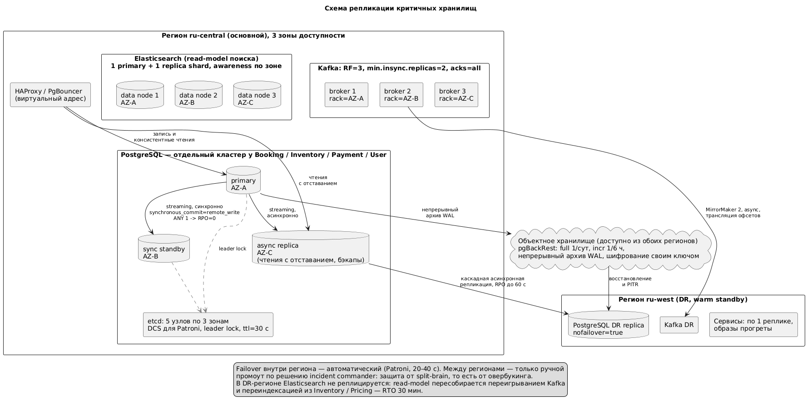
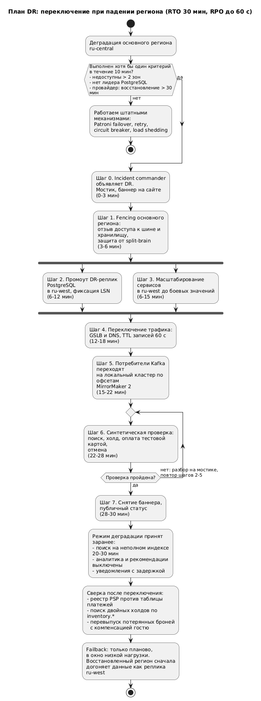

# ДЗ 5. Отказоустойчивость, observability и тестирование — решение

> Условие: [../Задание.md](../Задание.md)
> Шаблоны: [метрики](../Чек-лист%20метрик.md) · [алерты](../Шаблон%20описания%20алертов.md) ·
> [chaos-эксперименты](../Примеры%20Chaos-экспериментов.md)

**Система из ДЗ 2:** сервис бронирования отелей (аналог Booking).
**Сервисы:** API Gateway, Search, Inventory/Availability, Booking, Pricing, Payment,
User/Identity, Notification. **Инфраструктура:** PostgreSQL, Kafka, Elasticsearch, Redis.

**Топология для расчётов:** основной регион `ru-central` (3 зоны доступности), резервный
`ru-west` (warm standby). Внутри региона active-active по зонам, между регионами active-passive.

---

## Отказоустойчивость

### 1. RTO / RPO по сервисам

RTO — время возврата в строй, RPO — допустимая потеря данных во времени.
RPO=0 для всего не ставим: синхронная репликация между регионами добавляет к каждой записи
межрегиональный RTT 30–40 мс и убивает latency критичного пути бронирования.

| Сервис / хранилище | RTO | RPO | Обоснование |
|---|---|---|---|
| **API Gateway** | 1 мин | не применимо | Stateless, N+2 реплики. Отказ = полная недоступность продукта, но восстановление дешёвое: переключение балансировщика на здоровые поды |
| **Booking + БД броней** | 5 мин | 0 внутри региона, до 60 с при потере региона | Подтверждённая бронь — обязательство перед гостем. Внутри региона RPO=0 даёт синхронный standby в соседней зоне; межрегиональный RPO=0 нерентабелен, потерянные единицы броней разбираются по реестру PSP |
| **Inventory + БД** | 5 мин | 0 внутри региона, до 60 с при потере региона | Источник правды по остаткам. Потеря записи о холде = овербукинг, самый дорогой отказ системы. Восстанавливается согласованно с Booking |
| **Payment + БД платежей** | 10 мин | 0 (реконструируется по реестру PSP) | Расхождение с эквайером недопустимо, но состояние платежа всегда восстановимо по реестру PSP и идемпотентным ключам. RTO выше, чем у Booking: бронь ждёт в `PENDING_PAYMENT` под холдом TTL 15 мин |
| **User/Identity + БД** | 10 мин | 0 | Без входа недоступны личный кабинет и повторные брони, гостевой поиск работает. Потеря учётки неприемлема |
| **Pricing + БД тарифов** | 15 мин | 15 мин | Тарифы приходят фидами отельеров, потерянные обновления догоняются переигрыванием фида. При отказе — цена из кеша, подтверждение брони по ней запрещено |
| **Search + Elasticsearch** | 30 мин | 15 мин | Производное хранилище (read-model CQRS), восстанавливается переигрыванием Kafka и переиндексацией. Устаревшая выдача не даёт овербукинга: доступность перепроверяется в Inventory на шаге холда |
| **Notification** | 1 час | 15 мин | Ничего не блокирует: события лежат в Kafka 7 дней, письма уйдут с задержкой |
| **Kafka** | 10 мин | 0 | RF=3, `min.insync.replicas=2`, `acks=all` — подтверждённое событие переживает потерю брокера или зоны |
| **Redis** (кеш, rate limit, сессии SSE) | 5 мин | не применимо | Только производные данные, отказ = рост нагрузки на PostgreSQL и Elasticsearch. Холды и брони в Redis не хранятся |

Целевая доступность: Tier 1 (Booking, Inventory, Payment, Gateway) — 99,95 %;
Tier 2 (Search, Identity, Pricing) — 99,9 %; Tier 3 (Notification) — 99,5 %.

---

### 2. Репликация критичных БД



*Исходник: [diagrams/replication.puml](diagrams/replication.puml)*

#### 2.1. PostgreSQL (Booking, Inventory, Payment, User)

Database per service, у каждого сервиса свой кластер с одинаковой топологией:

| Узел | Зона | Режим | Роль |
|---|---|---|---|
| `primary` | AZ-A | — | Записи и чтения, требующие строгой консистентности |
| `sync-standby` | AZ-B | `synchronous_commit = remote_write`, `synchronous_standby_names = ANY 1` | Кандидат на failover, обеспечивает RPO=0 внутри региона |
| `async-replica` | AZ-C | асинхронная | Чтения с отставанием, снятие бэкапов |
| `dr-replica` | `ru-west` | асинхронная, каскадом от `async-replica` | Резерв на случай потери региона, RPO до 60 с |

- **Failover** — Patroni, DCS на etcd (5 узлов по трём зонам, кворум переживает потерю зоны).
  Приложение ходит через HAProxy/PgBouncer на виртуальном адресе, смена лидера выглядит как
  переподключение. `ttl = 30 с`, `loop_wait = 10 с`, фактический failover 20–40 с — с запасом в RTO 5 мин.
- **Защита от split-brain** — запись разрешена только держателю leader-ключа в etcd,
  на DR-реплике `nofailover = true`.
- **Режим `ANY 1`** — при падении sync-standby синхронную роль берёт реплика из AZ-C.
  Потеря обеих переводит кластер в read-only: для Inventory это лучше, чем продажи без
  гарантии сохранности.
- **Бэкапы** — pgBackRest: full раз в сутки, incr каждые 6 часов, непрерывный архив WAL
  в объектное хранилище. Это защита от логической порчи данных, от которой репликация не
  спасает — реплика повторит ошибку. Ретеншен 30 дней, проверка восстановления ежемесячно.
- **Партиционирование Inventory** — календарь доступности по `hotel_id` (hash, 64 партиции),
  чтобы проблема с партицией задевала часть отелей, а не весь инвентарь.

#### 2.2. Kafka

3 брокера по зонам, `broker.rack` = зона. Доменные топики: `replication.factor = 3`,
`min.insync.replicas = 2`, продюсеры с `acks = all` и `enable.idempotence = true`.
Ретеншен 7 дней — достаточно, чтобы пересобрать read-model поиска и разобрать инцидент.
В DR-регион — MirrorMaker 2 асинхронно, с трансляцией офсетов групп.

#### 2.3. Elasticsearch

3 data-ноды по зонам, `number_of_replicas = 1`, `allocation.awareness` по зоне — реплика
шарда всегда в другой зоне. В DR-регионе реплики нет: индекс восстанавливается переигрыванием
Kafka и переиндексацией из Inventory и Pricing, измеренное время укладывается в RTO 30 мин.

#### 2.4. Redis

Redis Cluster, реплика на зону, `AOF everysec`. Персистентность нужна не ради RPO,
а чтобы после рестарта не получить холодный кеш и лавину промахов в PostgreSQL.

---

### 3. Паттерны отказоустойчивости

Общее правило: таймаут есть у каждого сетевого вызова, ретраятся только идемпотентные
операции, circuit breaker ставится там, где зависимость может деградировать надолго.

#### 3.1. Timeout

Бюджет распределён сверху вниз от клиентских 10 с так, чтобы у оркестратора саги оставался
запас на компенсацию.

| Вызов | Connect | Request | Обоснование |
|---|---|---|---|
| Клиент -> API Gateway | — | 10 с | Верхняя граница ожидания пользователя на команде |
| Gateway -> Search | 200 мс | 1,5 с | Поиск при p99 = 400 мс, дальше выгоднее отдать частичный результат |
| Booking -> Inventory `CreateHold` | 100 мс | 800 мс | Короткая транзакция; долгий ответ означает блокировки, ждать бессмысленно |
| Booking -> Pricing `Quote` | 100 мс | 500 мс | При таймауте — fallback на закешированную цену |
| Booking -> Payment `Authorize` | 200 мс | 5 с | Внутри поход к внешнему PSP, самый долгий шаг саги |
| Payment -> PSP | 500 мс | 8 с | Внешняя система по SLA эквайера, результат продублируется вебхуком |
| Сервис -> PostgreSQL | 50 мс | `statement_timeout = 2 с`, `lock_timeout = 1 с` | Один запрос не должен удерживать соединения пула |

#### 3.2. Retry

| Где | Политика | Условия |
|---|---|---|
| Gateway -> Search | 2 повтора, backoff 50/150 мс, jitter | Чтение идемпотентно |
| Booking -> Inventory `CreateHold` | 2 повтора с тем же `idempotency_key` | Идемпотентность Inventory не даёт создать второй холд |
| Booking -> Payment `Authorize` | 1 повтор только по сетевой ошибке и таймауту, тот же ключ | Двойное списание недопустимо; на `PAYMENT_DECLINED` ретрай запрещён — это бизнес-ответ, а не сбой |
| Payment -> PSP | 3 повтора, backoff 1/3/9 с | Внешняя система с плавающей доступностью |
| Consumer Kafka | до 5 повторов, затем DLQ `<topic>.dlq` | Отравленное сообщение не должно блокировать партицию |
| Notification | до 5 повторов, backoff до 10 мин | Письмо не срочное |

Везде обязателен jitter (иначе ретраи синхронизируются и добивают восстанавливающийся сервис),
бюджет ретраев не больше родительского таймаута, ретраит только ближайший к сбою вызывающий —
счётчик передаётся в заголовке и не размножается по уровням.

#### 3.3. Circuit Breaker

| Зависимость | Порог открытия | Открыт | Half-open | Поведение в открытом состоянии |
|---|---|---|---|---|
| Payment -> PSP | > 50 % ошибок на окне 20 запросов | 30 с | 3 запроса | Бронь остаётся `PENDING_PAYMENT`, холд продлевается, пользователю предлагается оплатить позже по ссылке |
| Booking -> Pricing | > 50 % ошибок на окне 50 запросов | 15 с | 5 запросов | Цена из кеша с пометкой «предварительная», подтверждение по ней запрещено |
| Gateway -> Search | > 40 % ошибок или p99 > 3 с | 20 с | 5 запросов | Популярные направления из кеша плюс сообщение о неполноте выдачи |
| Booking -> Inventory | **не ставим** | — | — | Обходного пути нет: без Inventory нельзя продать номер, не нарушив главный инвариант. Работают таймаут, ретрай и быстрый `409/503` вместо ожидания |

#### 3.4. Bulkhead

- **По зависимостям.** У Booking отдельные пулы соединений и потоков на Inventory, Pricing
  и Payment: зависшая оплата не выест все потоки и не утащит холды.
- **По типу трафика.** Разные деплойменты и пулы к БД для чтения и записи Inventory
  (запись 40 соединений, чтение 20): наплыв поисковых перепроверок не отбирает соединения у продажи.
- **По приоритету клиента.** На Gateway отдельные rate limit и очереди для анонимного поиска,
  авторизованных пользователей и партнёрских API — деградация начинается с наименее ценного трафика.
- **По каналам уведомлений.** Отдельные consumer-группы для email, SMS и push: зависший
  SMS-провайдер не задерживает push.

Дополнительно: **load shedding** на Gateway (при насыщении отбрасываем поиск, но пропускаем
подтверждение начатых броней) и **TTL-холд 15 мин** как встроенная компенсация — при обрыве
саги номер возвращается в продажу автоматически.

---

### 4. План DR (падение региона)



*Исходник: [diagrams/dr.puml](diagrams/dr.puml)*

**Модель:** active-passive, warm standby. В `ru-west` постоянно работают DR-реплики PostgreSQL,
MirrorMaker 2 и по одной реплике каждого сервиса — образы прогреты, конфигурация проверена.
Цель: **RTO 30 мин, RPO до 60 с**.

**Критерии объявления DR** (любой из трёх, удерживается 10 мин):

1. Недоступны более двух зон основного региона или потеряна связность control plane.
2. Кластеры PostgreSQL без живого лидера, Patroni не поднимает его.
3. Провайдер подтвердил аварию с прогнозом восстановления больше 30 мин.

Решение принимает **incident commander**, а не автоматика: ложный автоматический межрегиональный
failover опаснее самого сбоя — он даёт split-brain по инвентарю, то есть овербукинг.

| Шаг | Действие | Время |
|---|---|---|
| 0 | Объявлен инцидент, собран мостик, баннер на сайте | 0–3 мин |
| 1 | Fencing основного региона: отзыв доступа к шине и объектному хранилищу, чтобы «воскресший» primary не принимал записи | 3–6 мин |
| 2 | Промоут DR-реплик PostgreSQL через Patroni, фиксация LSN для последующей сверки | 6–12 мин |
| 3 | Масштабирование сервисов в `ru-west` до боевых значений (параллельно шагу 2) | 6–15 мин |
| 4 | Переключение трафика: GSLB и DNS, TTL записей заранее 60 с | 12–18 мин |
| 5 | Переключение потребителей Kafka на локальный кластер по транслированным офсетам | 15–22 мин |
| 6 | Синтетическая проверка: поиск -> холд -> оплата тестовой картой -> отмена | 22–28 мин |
| 7 | Снятие баннера, публичный статус | 28–30 мин |

**Деградация в DR-режиме принята заранее:** поиск первые 20–30 мин на неполном индексе
(овербукинга не будет — доступность перепроверяется в Inventory); аналитика и рекомендации
выключены; уведомления идут с задержкой.

**Сверка после переключения** (обязательный этап):

- Разбор «дыры» RPO: реестр PSP за последний час против таблицы платежей, восстановление
  недолетевших платежей по идемпотентным ключам.
- Поиск двойных холдов по журналу `inventory.*` в Kafka, ручной разбор с отельерами.
- Потерянные брони перевыпускаются вручную с приоритетом и компенсацией гостю.

**Failback** — только планово, в окно низкой нагрузки: восстановленный регион сначала догоняет
данные как реплика `ru-west`, затем обратное переключение по той же процедуре.

**Учения:** failover PostgreSQL — ежемесячно на проде; восстановление из бэкапа и PITR —
ежемесячно; полное переключение региона (game day) — раз в полгода на staging с продовым
объёмом данных и замером фактических RTO/RPO.

---

## Observability

### 5. Ключевые метрики (RED / USE + бизнес)

| # | Сервис / ресурс | Метод | Метрика | Как меряем | Что покажет |
|---|---|---|---|---|---|
| 1 | API Gateway | RED | Rate: RPS по типу операции (search / booking / cancel) | counter с лейблами `route`, `method` | Профиль нагрузки и база для порогов; резкий провал — отказ выше по стеку |
| 2 | API Gateway | RED | Errors: доля 5xx и таймаутов отдельно от 4xx | counter по `status_class` | 5xx — наша вина, 4xx — поведение клиентов; смешение маскирует аварию всплеском ботов |
| 3 | API Gateway | RED | Duration: p50/p95/p99 по маршрутам | гистограмма с бакетами под SLO | Симптом «тормозит»; p99 ловит деградацию раньше среднего |
| 4 | Booking | RED | Errors: отказы `POST /v1/bookings` по причине (409 нет мест, 402 отказ оплаты, 5xx) | counter по `reason` | Отделяет нормальный отказ бизнеса от поломки: 5xx — дежурному, 409 — в инвентарь |
| 5 | Booking | RED | Duration: p95/p99 полного цикла саги до `CONFIRMED` | гистограмма времени жизни саги | Деградация, невидимая по отдельным вызовам: каждый шаг быстрый, а суммарно пользователь ждёт минуту |
| 6 | Booking | бизнес | Здоровье саг: незавершённые старше 15 мин и компенсации (`ReleaseHold`, `Refund`) в минуту | gauge по состояниям + counter | Зависшая сага = удержанный номер и деньги в подвешенном состоянии; рост компенсаций — проблемы в оплате или инвентаре |
| 7 | Inventory | RED | Duration: p99 `CreateHold` | гистограмма gRPC-метода | Самый критичный синхронный шаг, его деградация тормозит все брони |
| 8 | Inventory | бизнес | Конфликты доступности (попытки продать занятое) в минуту | counter | Прямой сигнал риска овербукинга: расхождение read-model и источника правды |
| 9 | Payment | RED | Errors: отказы PSP по типам `declined` / `timeout` / `5xx` | counter по `psp_status` | `declined` — норма рынка, `timeout` и `5xx` — деградация эквайера; реакции разные |
| 10 | Payment | RED | Duration: p95/p99 `Authorize` | гистограмма | Внешняя зависимость — вероятный источник роста latency всей саги |
| 11 | Search | RED | Duration: p95/p99 поискового запроса | гистограмма по типу запроса | Вход в воронку, latency напрямую влияет на конверсию |
| 12 | PostgreSQL | USE | Utilization пула соединений PgBouncer | gauge `used / max` | Причина, видимая до симптома (рост p99 и таймауты) |
| 13 | PostgreSQL | USE | Saturation: lag sync- и async-реплик в байтах и секундах | `pg_wal_lsn_diff`, `replay_lag` | Проверка выполнимости заявленного RPO |
| 14 | PostgreSQL | USE | Errors: deadlock и `lock_timeout` в минуту | `pg_stat_database`, логи | Конкуренция за одни номера в пиковые даты |
| 15 | Kafka | USE | Saturation: consumer lag по группам (search-indexer, notification, saga-continuation) | gauge lag в сообщениях | Лаг индексатора — устаревшая выдача, лаг саги — зависшие брони |
| 16 | Kafka | USE | Errors: размер DLQ и скорость поступления в него | counter | Потерянные бизнес-факты, которые без вмешательства никто не обработает |
| 17 | Elasticsearch | USE | Utilization: CPU и heap data-нод, глубина очереди и `rejected` в search thread pool | gauge + counter | Отказы очереди появляются раньше роста latency, дают время добавить ноды |
| 18 | Kubernetes / ноды | USE | CPU throttling подов, память к limit, OOMKill и рестарты | cAdvisor | Троттлинг объясняет «беспричинный» рост latency, OOMKill — неверные лимиты |
| 19 | Продукт | бизнес | Подтверждённые брони в минуту и конверсия по шагам воронки (поиск -> карточка -> холд -> оплата) | counter + воронка | Главный индикатор здоровья; провал конкретного шага сразу локализует сбой |
| 20 | Продукт | бизнес | Доля холдов, истёкших по TTL без оплаты | доля от созданных холдов | Рост означает, что оплата ломается или тормозит; косвенно измеряет потерянную выручку |

---

### 6. Алерты

Алертим на симптомы. Метрики-причины (12–18) идут на дашборды и в runbook, но сами никого не будят.

```
Название:          Падение потока подтверждённых броней
Условие/порог:     confirmed_bookings_per_min < 40 % от прогноза (сравнение с той же минутой
                   неделю назад) в течение 10 мин
Severity:          critical (будит)
Что означает:      пользователи не могут завершить бронирование, идёт потеря выручки
Вероятная причина: сломан шаг саги, отказ PSP, деградация Inventory, плохой релиз
Реакция:           1) воронка по шагам (метрика 19) -> где обрыв;
                   2) был ли деплой за 30 мин, при совпадении откатить;
                   3) состояние circuit breaker на Payment и Pricing;
                   4) при недоступности PSP включить отложенную оплату
Кому:              on-call booking
```

```
Название:          Рост 5xx на API Gateway
Условие/порог:     доля 5xx > 2 % трафика в течение 3 мин
Severity:          critical (будит)
Что означает:      часть пользователей получает отказы на любом сценарии
Вероятная причина: упала зависимость, исчерпан пул соединений, релиз сломал маршрут
Реакция:           1) разложить 5xx по маршрутам и upstream;
                   2) сверить с последним деплоем, при совпадении откатить;
                   3) проверить пулы соединений и насыщение БД (метрики 12, 18)
Кому:              on-call backend
```

```
Название:          Риск овербукинга: всплеск конфликтов доступности
Условие/порог:     inventory_availability_conflicts_per_min > 10 при норме до 1, 5 мин
Severity:          critical (будит)
Что означает:      система пытается продать занятые номера, гость рискует приехать в
                   проданный номер
Вероятная причина: отставание индексатора read-model, рассинхронизация после failover,
                   ошибка в логике TTL холдов
Реакция:           1) consumer lag search-indexer (метрика 15);
                   2) lag реплик и факт недавнего failover (метрика 13);
                   3) при подтверждении — принудительная переиндексация затронутых отелей
                   и временное ужесточение перепроверки в Inventory
Кому:              on-call inventory, дежурный менеджер по инвентарю
```

```
Название:          Деградация оплаты (PSP)
Условие/порог:     доля timeout и 5xx от PSP > 20 % в течение 5 мин
                   либо circuit breaker Payment открыт дольше 3 мин
Severity:          critical (будит)
Что означает:      брони не доходят до подтверждения, деньги не списываются
Вероятная причина: авария у эквайера, сетевая деградация до внешнего контура
Реакция:           1) статус-страница PSP, связаться с его дежурным;
                   2) убедиться, что брони уходят в PENDING_PAYMENT и холды продлеваются;
                   3) при затяжной аварии переключиться на резервного эквайера
Кому:              on-call payments
```

```
Название:          Отставание consumer-группы Kafka
Условие/порог:     lag saga-continuation > 10 000 сообщений или монотонный рост 30 мин;
                   lag search-indexer > 100 000 сообщений 15 мин
Severity:          critical для saga-continuation, warning для остальных
Что означает:      брони зависают неподтверждёнными, выдача поиска устаревает
Вероятная причина: медленный потребитель, сообщение-отравитель, нехватка партиций,
                   всплеск событий после массового изменения тарифов
Реакция:           1) растёт ли DLQ (метрика 16);
                   2) latency обработки и ошибки потребителя;
                   3) при всплеске — добавить инстансы потребителя, при отравленном
                   сообщении отправить его в DLQ вручную
Кому:              on-call platform
```

```
Название:          Lag синхронной реплики PostgreSQL Inventory
Условие/порог:     replay_lag синхронного standby > 5 с или > 512 МБ WAL в течение 5 мин
Severity:          warning, critical при потере кворума синхронных реплик
Что означает:      заявленный RPO=0 внутри региона сейчас не выполняется, failover приведёт
                   к потере данных об остатках
Вероятная причина: перегрузка диска standby, сетевая деградация между зонами,
                   долгая транзакция на primary
Реакция:           1) IOPS и очередь диска на standby;
                   2) сетевые метрики между зонами;
                   3) если быстро не чинится — перенести синхронную роль на реплику AZ-C,
                   не допуская работы без синхронного standby
Кому:              on-call dba
```

```
Название:          Выгорание error budget SLO бронирования
Условие/порог:     multi-window burn rate: 14x на окне 1 ч и 6x на окне 6 ч
                   для SLO «99,9 % успешных POST /v1/bookings за 30 дней»
Severity:          warning, critical при burn rate > 14x на окне 6 ч
Что означает:      месячный бюджет ошибок будет исчерпан досрочно
Вероятная причина: накопление мелких деградаций, не пробивающих пороги разовых алертов
Реакция:           1) freeze рискованных релизов до восстановления бюджета;
                   2) разложить ошибки по причинам, завести задачи;
                   3) вынести на еженедельный разбор надёжности
Кому:              команда booking, без ночной эскалации
```

---

### 7. Что логируем и трейсим

#### 7.1. Логи

Структурированный JSON, сбор через Vector в Loki (тёплое хранение) и объектное хранилище (холодное).

**Обязательные поля:** `timestamp` (UTC), `level`, `service`, `version`, `env`, `region`, `pod`,
`trace_id`, `span_id`, `request_id`, `user_id` (псевдонимизированный), `booking_id`, `message`,
`duration_ms`, `error.type` и `error.stack` для ошибок. `trace_id` обязателен в каждой строке —
именно он связывает логи с трейсами.

| Категория | Уровень | Примеры | Зачем |
|---|---|---|---|
| Бизнес-события саги | INFO | `hold_created`, `payment_authorized`, `booking_confirmed`, `compensation_started` | Восстановить историю брони при разборе жалобы |
| Границы сервиса | INFO | входящий запрос и ответ с кодом и длительностью | Attribution: чей отказ |
| Отказы зависимостей | ERROR | таймауты, открытие circuit breaker, исчерпание ретраев | Реакция дежурного, постмортемы |
| Аномальные бизнес-состояния | WARN | истёкший холд при оплаченном платеже, конфликт доступности, попадание в DLQ | Ручной разбор |
| Аудит (отдельный поток) | INFO | вход, смена пароля, доступ к персональным данным, возвраты, действия администраторов | Требования безопасности; хранится 1 год иммутабельно |
| Отладка | DEBUG | детали запросов | Выключен на проде, включается точечно на время инцидента |

**Не логируем никогда:** номера карт, CVV, токены и заголовки `Authorization`, пароли,
паспортные данные, тела платёжных запросов. Персональные данные маскируются на уровне
библиотеки логирования (`a***@mail.ru`, `+7***4567`); запрет проверяется линтером в CI.

**Ретеншен:** ERROR и WARN — 30 дней горячего хранения, INFO — 7 дней, аудит — 1 год,
холодное хранилище — 90 дней. Поиск логируется сэмплированно (1 %), путь бронирования —
полностью: каждая бронь имеет цену и разбирается поштучно.

#### 7.2. Трейсы

OpenTelemetry, контекст через W3C `traceparent` — и в gRPC-вызовах, и в заголовках сообщений
Kafka, иначе асинхронная часть саги выпадает из трейса. Экспорт в Tempo.

Трассируем в первую очередь:

1. **Путь бронирования** — Gateway `POST /v1/bookings` -> Booking (сага) -> Inventory `CreateHold`
   -> Pricing `Quote` -> Payment `Authorize` -> PSP -> вебхук -> событие `PaymentAuthorized`
   -> продолжение саги -> `booking_confirmed`. Отвечает на вопрос, на каком шаге ушло время.
2. **Путь поиска** — Gateway -> Search -> Elasticsearch, включая кеш и агрегации.
3. **Отмена и возврат** — Booking -> Inventory `ReleaseHold` -> Payment `Refund` -> уведомление.
4. **Асинхронные потребители** — обработка события индексатором и нотификатором как продолжение
   исходного трейса (span link на producer-span).

**Атрибуты спанов:** `booking_id`, `hotel_id`, `room_type_id`, `saga_step`, `idempotency_key`,
`retry_attempt`, `circuit_breaker_state`, `db.statement` (нормализованный), `messaging.kafka.partition`,
`psp.name`. Персональных данных в атрибутах нет.

**Сэмплирование:** head-based 1 % на поиске, 100 % на командах бронирования, отмены и оплаты
(их объём на порядки меньше), плюс tail-based правило «сохранять трейс целиком, если он содержит
ошибку или длится дольше p99». Ретеншен 14 дней.

**Связывание сигналов:** `trace_id` есть в логах, добавляется exemplar-ссылкой к гистограммам
latency в Prometheus и возвращается клиенту в `X-Trace-Id`, чтобы поддержка по обращению сразу
открывала трейс.

---

## Тестирование

### 8. План нагрузочного тестирования

**Инструмент:** k6, сценарии в репозитории рядом с сервисом, запуск в CI и по расписанию.
Профиль строится из метрик пункта 5, а не из предположений.

**Стенд:** отдельный контур, идентичный проду по топологии и версиям, обезличенный слепок
продовых данных (около 200 тыс. отелей, 2 года календаря). PSP заменён моком с его реальным
распределением latency и отказов (p95 = 1,2 с, 3 % declined) — иначе тест меряет чужую систему.

**Профиль трафика** (продовые пропорции): 80 % поиск, 12 % карточка отеля, 6 % создание брони,
2 % отмены. Расчётный пик: 3 000 RPS поиска и 60 RPS бронирования (высокий сезон плюс запас 1,5x).

| # | Тип | Сценарий | Длительность | Что проверяем |
|---|---|---|---|---|
| 1 | Smoke | 1 VU на каждый сценарий | 2 мин | Работоспособность стенда и скриптов перед прогоном |
| 2 | Load | 100 % расчётного пика, ровное плато | 30 мин | Соответствие SLO на ожидаемой нагрузке |
| 3 | Stress | Ступени по 500 RPS поиска до отказа | до отказа | Точка насыщения и что ломается первым (обычно пул к PostgreSQL или thread pool Elasticsearch) |
| 4 | Spike | 20 % -> 300 % пика за 60 с, плато 10 мин, спад | 20 мин | Load shedding и rate limit, успевает ли HPA, нет ли каскада |
| 5 | Soak | 60 % пика непрерывно | 12 ч | Утечки памяти и соединений, накопление зависших саг, рост таблицы холдов |
| 6 | Конкуренция за дефицит | 200 параллельных пользователей на один номер и даты | 10 мин | Главный инвариант: ровно один успешный холд, остальные `409`, без deadlock |
| 7 | Деградация зависимости | Целевой пик плюс 2 с latency у мока PSP | 15 мин | Не растекается ли деградация оплаты на поиск (bulkhead), открывается ли circuit breaker |
| 8 | Failover под нагрузкой | Принудительный switchover primary PostgreSQL Inventory | 15 мин | Фактическое время недоступности записи против заявленного RTO |

**Критерии приёмки прогона**

| Показатель | Порог |
|---|---|
| p95 / p99 поиска | ≤ 400 мс / ≤ 1 с |
| p95 `POST /v1/bookings` (без времени PSP) | ≤ 1,2 с |
| p99 полного цикла саги | ≤ 8 с |
| Доля 5xx | ≤ 0,1 % |
| Успешные брони в сценарии 2 | ≥ 99,5 % |
| Овербукинг в сценарии 6 | 0 — блокирующий критерий |
| CPU сервисов на целевом пике | ≤ 60 % (запас на отказ зоны) |
| Пул соединений PostgreSQL | ≤ 70 % |
| Рост p95 за 12 ч в сценарии 5 | ≤ 10 % от первого часа |
| Зависшие саги после прогона | 0 |

**Регламент:** сценарии 1–2 на каждый релиз-кандидат в CI, релиз блокируется при нарушении
порогов; 3–5 раз в спринт ночью; 6–8 перед высоким сезоном и после изменений в инвентаре,
оплате или схеме репликации. Результаты сравниваются с предыдущими прогонами — важен тренд,
а не только факт прохождения.

---

### 9. Chaos Engineering

Три эксперимента бьют по разным механизмам: circuit breaker и bulkhead, репликация и
автоматический failover, гарантии доставки событий. Сначала staging, затем прод в окно низкой
нагрузки с дежурным на связи.

```
Эксперимент №1: деградация внешнего эквайера
Steady state:    подтверждённые брони ≥ 95 % базового уровня; p95 поиска ≤ 400 мс
Гипотеза:        при росте latency PSP до 10 с circuit breaker в Payment откроется быстрее
                 60 с, брони перейдут в PENDING_PAYMENT с продлением холда, а поиск и карточка
                 отеля не деградируют — у Booking отдельный пул на Payment (bulkhead)
Blast radius:    5 % трафика оплаты, один namespace, один PSP из двух подключённых
Метод:           toxiproxy между Payment и PSP: задержка 10 с и 30 % ошибок на 15 мин
Наблюдаем:       метрики 9, 10 (ошибки и latency PSP), 3 и 11 (latency Gateway и поиска),
                 6 (зависшие саги), 20 (истёкшие холды); алерты «Деградация оплаты»
                 и «Падение потока броней»
Rollback:        успешные брони ниже 80 % базового уровня или p95 поиска выше 600 мс —
                 значит изоляция пулов не работает
Ожидаемый вывод: подтверждаем или опровергаем локализацию отказа платежей; отдельно проверяем,
                 что алерт срабатывает раньше обращений в поддержку
```

```
Эксперимент №2: потеря зоны с primary PostgreSQL Inventory
Steady state:    успешные холды ≥ 95 % базового уровня; конфликтов доступности ≤ 1/мин
Гипотеза:        при изоляции AZ-A Patroni выполнит failover на sync-standby в AZ-B быстрее
                 60 с, данные не потеряются (RPO=0 внутри региона), приложение переподключится
                 через HAProxy, пользователи увидят не более минуты ошибок на записи
Blast radius:    одна зона, один кластер PostgreSQL (Inventory), окно низкой нагрузки
Метод:           сетевые правила изолируют узлы AZ-A от других зон и от etcd (моделируем split,
                 а не мягкую остановку), 10 мин
Наблюдаем:       метрики 7 (p99 CreateHold), 12 (пул соединений), 13 (lag реплик),
                 14 (deadlock и lock_timeout), 8 (конфликты доступности), 19 (поток броней);
                 фиксируем фактическое время failover, число потерянных запросов и LSN промоута
Rollback:        снимаем изоляцию, если failover не произошёл за 3 мин или появились признаки
                 split-brain (записи на двух узлах)
Ожидаемый вывод: измеренные RTO и RPO против заявленных в пункте 1; проверка главного
                 инварианта — после failover не возникло ни одной двойной продажи
```

```
Эксперимент №3: отказ брокера Kafka и накопление lag
Steady state:    lag search-indexer ≤ 5 000, lag saga-continuation ≤ 1 000,
                 доля устаревших результатов поиска ≤ 1 %
Гипотеза:        при остановке одного брокера из трёх (RF=3, min.insync.replicas=2)
                 подтверждённые события не теряются, потребители переподключаются к новым
                 лидерам партиций, накопленный lag разбирается быстрее 10 мин после
                 восстановления, а перепроверка в Inventory не даёт устаревшей выдаче
                 превратиться в овербукинг
Blast radius:    один брокер, топики поиска и уведомлений; топики саги подключаются
                 только после успешной первой итерации
Метод:           остановка брокера на 10 мин с возвратом, параллельно задержка 500 мс
                 между потребителем и кластером
Наблюдаем:       метрики 15 (lag по группам), 16 (DLQ), 8 (конфликты доступности),
                 5 (длительность саги), 11 (latency поиска); сверяем число опубликованных
                 и обработанных событий по идентификаторам
Rollback:        поднимаем брокер немедленно при росте DLQ или конфликтах доступности > 10/мин
Ожидаемый вывод: подтверждение at-least-once и корректного отсечения дубликатов
                 идемпотентностью потребителей; побочно — реальная скорость разбора lag,
                 что уточняет порог соответствующего алерта
```

---

## Безопасность

### 10. Аутентификация и авторизация

**Пользователи.** OAuth 2.1 + OpenID Connect, провайдер — Keycloak (роль User/Identity из ДЗ 2),
поток Authorization Code с PKCE для web и mobile.

- **Access token** — JWT RS256, 15 мин. Проверяется на Gateway (подпись, `iss`, `aud`, `exp`)
  и повторно в сервисах, чтобы Gateway не был единственной точкой доверия. Ключи ротируются,
  публичные раздаются через JWKS.
- **Refresh token** — opaque, в httpOnly Secure SameSite cookie, 30 дней, ротация при каждом
  использовании с обнаружением повторного применения (признак кражи, цепочка отзывается).
- **MFA** — обязательна для операторов и администраторов, опциональна для пользователей.
- **Отзыв** — короткий access-токен плюс список отозванных сессий в Redis, проверяемый на Gateway.

**Авторизация.** RBAC (`guest`, `user`, `hotel_manager`, `support`, `admin`) плюс проверка
владения ресурсом в сервисе-владельце данных: отменить бронь может её владелец или менеджер
отеля. Права выражены скоупами (`booking:read`, `booking:write`, `payment:refund`).

**Сервис-сервис.** Взаимный TLS в service mesh, идентичность — SPIFFE ID из автоматически
выдаваемого короткоживущего сертификата. Поверх — политики mesh: явный список, кто кого может
вызывать (например, `Payment.Capture` доступен только Booking). Пользовательский контекст
пробрасывается отдельным подписанным заголовком и не подменяет сервисную идентичность.

**Партнёры.** Отдельные OAuth-клиенты с client credentials, своими квотами и доменом API.
Вебхуки PSP проверяются по HMAC-подписи и списку разрешённых адресов, обрабатываются идемпотентно.

**На входе.** Rate limit по пользователю, IP и клиенту; защита от перебора на форме входа;
WAF перед Gateway; ограничение размера запроса; строгая валидация схем.

### 11. Что шифруем

**В канале**

| Участок | Механизм |
|---|---|
| Клиент -> CDN -> Gateway | TLS 1.3, HSTS, сертификаты через ACME с автоматической ротацией |
| Между сервисами | mTLS в mesh, TLS 1.3 |
| Сервисы -> PostgreSQL / Kafka / Elasticsearch / Redis | TLS, для PostgreSQL `sslmode=verify-full` |
| Репликация PostgreSQL между зонами и регионами | TLS |
| Payment -> PSP | TLS 1.3, закрепление корневого CA, подпись запросов |

**На диске**

| Данные | Механизм | Почему так |
|---|---|---|
| Тома БД, брокера, объектного хранилища | Прозрачное шифрование дисков и бакетов ключами KMS | Базовый уровень, защита от компрометации носителя |
| Персональные данные: ФИО, email, телефон, документы гостей | Шифрование на уровне приложения (AES-256-GCM), ключ в Vault, в БД только шифротекст | Диск-шифрование не спасает от утечки дампа или SQL-инъекции, а это самые ценные для злоумышленника поля |
| Поиск по персональным данным | Детерминированный HMAC-индекс отдельным ключом | Позволяет искать по email без хранения открытого значения |
| Пароли | Argon2id с солью и перцем, перец в Vault | Стандарт необратимого хранения |
| Платёжные реквизиты | **Не храним.** Карта вводится в поле PSP, у нас только его токен и последние 4 цифры | Радикально сокращает область PCI DSS: чего нет, то нельзя украсть |
| Бэкапы и WAL-архив | Шифрование pgBackRest, ключ хранится отдельно от бэкапа | Бэкап — самая частая точка утечки |
| Логи и трейсы | Шифрование хранилища, маскирование персональных данных на записи | Логи копятся дольше всего и доступны шире всего |

**Ключи.** Vault как единственный источник: приложения получают ключи по короткоживущему токену
привязанной к поду идентичности, секретов в конфигах и образах нет. Ротация ключей шифрования
данных — раз в год и немедленно при подозрении на компрометацию, с фоновым перешифрованием;
TLS-сертификаты ротируются автоматически. Доступ к ключам и персональным данным пишется
в аудит-поток из пункта 7.

**Хранение.** Payment живёт в отдельном сетевом сегменте с собственными политиками доступа
(требование PCI DSS). Персональные данные обезличиваются по истечении срока: данные гостя —
через 5 лет после последней брони, платёжные токены — по правилам эквайера.
