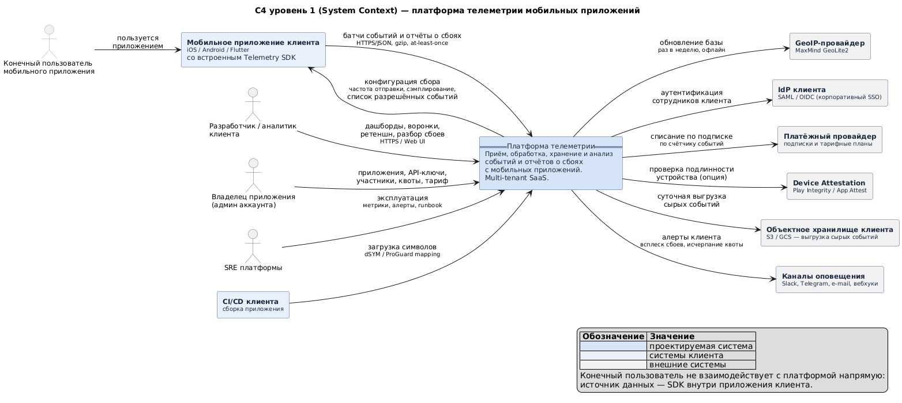
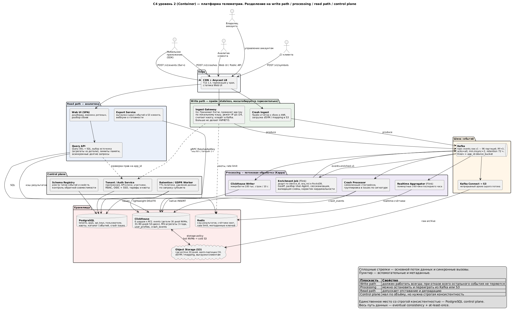
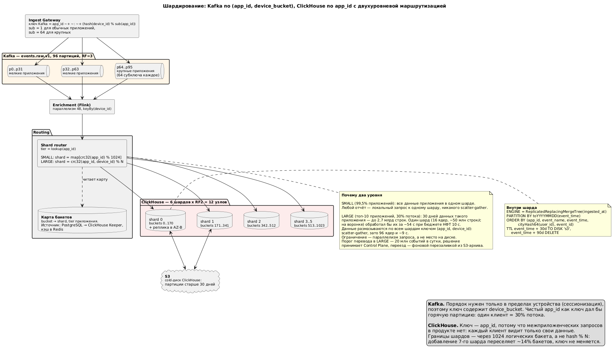
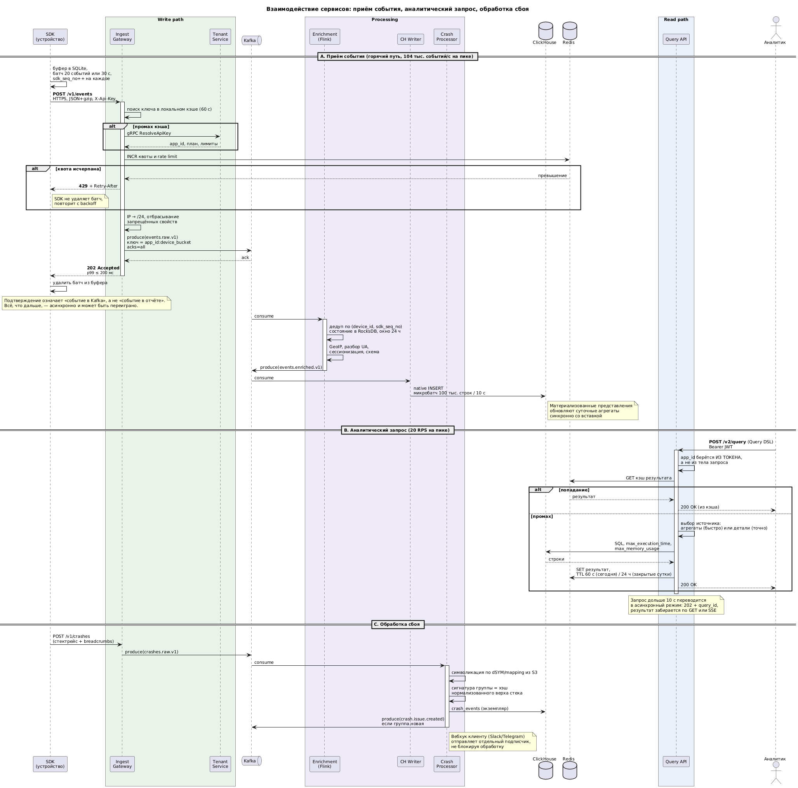
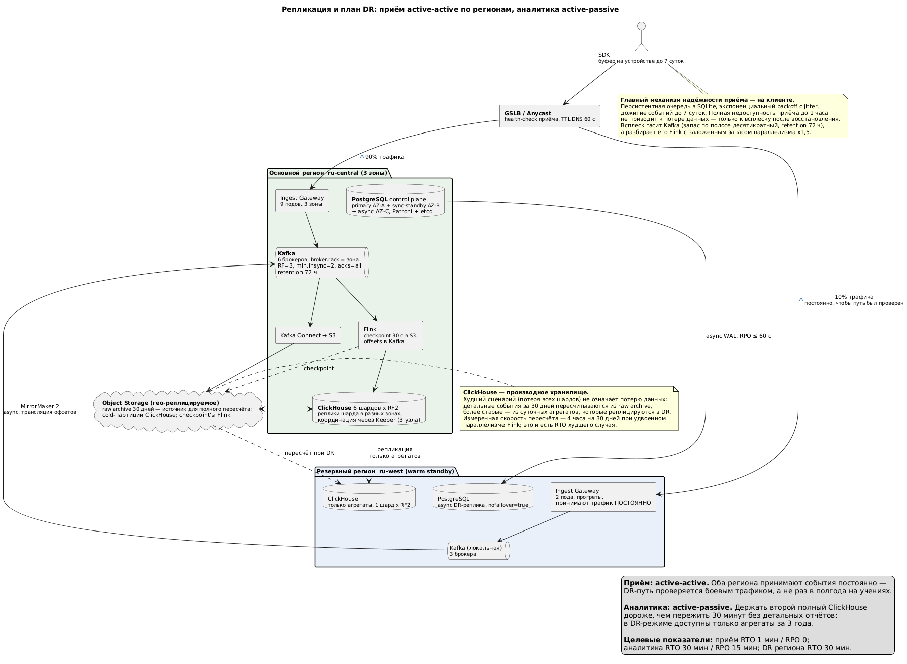

# ДЗ 6. Проектная работа: платформа телеметрии мобильных приложений

> Условие: [../Задание.md](../Задание.md) · Схемы: [diagrams/](diagrams/) · Решения: [adr/](adr/)

**Тема:** Сервис телеметрии для мобильных приложений —
события продуктовой аналитики и отчёты о сбоях. Функциональный аналог AppMetrica,
Firebase Analytics и Sentry в одном продукте.

**Оглавление**

1. [Требования](#1-требования) · 2. [Концептуальная архитектура](#2-концептуальная-архитектура) ·
3. [Сайзинг](#3-сайзинг) · 4. [Хранение данных](#4-хранение-данных) ·
5. [Взаимодействие](#5-взаимодействие) · 6. [Надёжность](#6-надёжность) ·
7. [Безопасность](#7-безопасность) · 8. [Observability](#8-observability) ·
9. [Тестирование](#9-тестирование) · [Соответствие критериям](#соответствие-критериям-оценки)

---

## 1. Требования

### 1.1. Функциональные требования (scope)

| #       | Возможность                    | Содержание                                                                                                                                                                                                |
|---------|--------------------------------|-----------------------------------------------------------------------------------------------------------------------------------------------------------------------------------------------------------|
| **F1**  | **Приём событий**              | SDK для iOS, Android и Flutter собирает события (запуск, экран, действие, произвольное событие с атрибутами), буферизует их на устройстве и отправляет батчами. Приём идемпотентен и устойчив к повторам. |
| **F2**  | **Обогащение и сессионизация** | Определение страны и региона по IP, модели устройства и версии ОС по User-Agent, склейка событий в сессии по правилу «30 минут неактивности», присвоение сквозного `session_id`.                          |
| **F3**  | **Продуктовая аналитика**      | Дашборды: DAU/WAU/MAU, число событий по типам, разрезы по стране, платформе, версии приложения и источнику установки. Готовые отчёты и произвольные срезы.                                                |
| **F4**  | **Воронки и ретеншн**          | Воронка по упорядоченной последовательности событий с настраиваемым окном конверсии; когортный ретеншн (N-day и unbounded) на горизонте до 90 дней.                                                       |
| **F5**  | **Отчёты о сбоях**             | Приём крэшей и ANR со стектрейсом и breadcrumbs, символикация по загруженным dSYM / ProGuard mapping, группировка экземпляров в issue по сигнатуре стека, статистика «доля сессий без сбоев» по версиям.  |
| **F6**  | **Реальное время**             | Виджет последнего часа с поминутной детализацией — наблюдение за раскаткой релиза.                                                                                                                        |
| **F7**  | **Путь пользователя**          | Просмотр хронологии событий конкретного устройства или пользователя за период — для разбора обращений в поддержку.                                                                                        |
| **F8**  | **Управление аккаунтом**       | Организации, приложения, API-ключи с ротацией, участники и роли, тарифные планы и квоты, счётчик потребления.                                                                                             |
| **F9**  | **Каталог событий**            | Реестр типов событий и их свойств с контролем совместимости: новое обязательное свойство или смена типа — ломающее изменение, которое блокируется.                                                        |
| **F10** | **Экспорт**                    | Суточная выгрузка сырых событий в объектное хранилище клиента (Parquet) и публичное API отчётов для интеграции с BI клиента.                                                                              |
| **F11** | **Алерты клиента**             | Уведомление в Telegram / e-mail при всплеске сбоев, появлении нового issue, исчерпании квоты.                                                                                                             |
| **F12** | **Приватность**                | Удаление всех данных конкретного пользователя по запросу субъекта персональных данных; конфигурируемое отключение сбора идентификаторов.                                                                  |

### 1.2. Нефункциональные требования

Числа ниже — вход для всех расчётов раздела 3 и критерии приёмки нагрузочного
тестирования раздела 9.

**Масштаб**

| Показатель                     | Значение                                                   |
|--------------------------------|------------------------------------------------------------|
| Приложений-клиентов            | 2 000                                                      |
| Конечных пользователей         | 150 млн MAU / **30 млн DAU**                               |
| Сессий на пользователя в сутки | 4                                                          |
| Событий за сессию              | 25                                                         |
| **Событий в сутки**            | **3 млрд**                                                 |
| Событий в секунду              | 34 722 среднее / **104 167 пиковое**                       |
| Крэшей в сутки                 | 600 тыс. (0,5% сессий)                                     |
| Аналитических запросов         | 346 тыс./сут, 20 RPS на пике                               |
| Горизонт планирования          | ×3 к объёму без смены архитектуры, ×10 — добавлением узлов |

**Производительность и задержки**

| Показатель                             | Значение                                  | Комментарий                 |
|----------------------------------------|-------------------------------------------|-----------------------------|
| `POST /v1/events`, p99                 | **≤ 200 мс**                              | приём только пишет в Kafka  |
| `POST /v1/events`, p999                | ≤ 500 мс                                  |                             |
| **E2E «событие → доступно в запросе»** | p50 ≤ 60 с, **p95 ≤ 5 мин**, p99 ≤ 15 мин | ключевое НФТ продукта       |
| Realtime-виджет последнего часа        | p95 ≤ 60 с                                |                             |
| Стандартный отчёт, окно 30 дней        | **p95 ≤ 2 с**                             | обслуживается агрегатами    |
| Воронка / ретеншн, окно 90 дней        | **p95 ≤ 10 с**                            | сканирует детальные события |
| Таймаут аналитического запроса         | 60 с, затем асинхронный режим             |                             |

**Надёжность и целостность данных**

| Показатель                                                   | Значение                        |
|--------------------------------------------------------------|---------------------------------|
| Доступность приёма (Tier 1)                                  | **99,95%** (≤ 22 мин/мес)       |
| Доступность аналитики (Tier 2)                               | 99,5%                           |
| Доступность экспорта, уведомлений и обработки сбоев (Tier 3) | 99%                             |
| **Потеря событий**                                           | **≤ 0,01%**                     |
| **Доля дублей в отчётах**                                    | **≤ 0,001%**                    |
| Приём поздних событий                                        | до **7 суток** по `event_time`  |
| Окно дедупликации                                            | 24 часа неактивности устройства |
| RPO приёма / RTO приёма                                      | 0 / 1 мин                       |
| RPO аналитики / RTO аналитики                                | 15 мин / 30 мин                 |

**Хранение**

| Показатель                                     | Значение                                            |
|------------------------------------------------|-----------------------------------------------------|
| Детальные события                              | 30 дней на NVMe + 31–90 дней на объектном хранилище |
| Суточные агрегаты                              | 3 года                                              |
| Архив сырого потока                            | 30 дней (источник для пересчёта)                    |
| Символы (dSYM / mapping)                       | 2 года                                              |
| Исполнение запроса на удаление данных субъекта | ≤ 30 дней                                           |

**Эксплуатация и стоимость**

| Показатель                        | Значение                                     |
|-----------------------------------|----------------------------------------------|
| Целевая стоимость                 | ≤ 15 ₽ за 1 млн принятых событий             |
| Целевая утилизация CPU на пике    | ≤ 60% (запас на отказ зоны)                  |
| Обратная совместимость API приёма | не ломать в течение 3 лет                    |
| Резидентность данных              | контур в РФ для российских клиентов (152-ФЗ) |

### 1.3. Риски и ограничения

| #      | Риск / ограничение                                                                                                   | Последствие                                                                            | Как парируем                                                                                                                                                                                                     |
|--------|----------------------------------------------------------------------------------------------------------------------|----------------------------------------------------------------------------------------|------------------------------------------------------------------------------------------------------------------------------------------------------------------------------------------------------------------|
| **R1** | **SDK нельзя обновить по команде.** Версия живёт в приложениях у конечных пользователей годами                       | Любое ломающее изменение протокола приёма отрезает часть трафика навсегда              | Версионирование в пути (`/v1/events`), только аддитивные изменения, серверная конфигурация сбора доставляется самим SDK. `sdk_seq_no` введён в протокол v1 заранее — см. [ADR-003](adr/ADR-003-at-least-once.md) |
| **R2** | **App key физически извлекается из APK.** Скрыть секрет на клиенте невозможно                                        | Подделка событий, «отравление» аналитики клиента, исчерпание его квоты                 | Ограничение принимается честно: rate limit по `(app_key, install_id, IP)`, отбраковка аномалий, опциональная аттестация через Play Integrity / App Attest для тарифов, где это критично                          |
| **R3** | **Взрыв кардинальности.** Клиент кладёт в свойство события UUID заказа или таймстамп                                 | Раздувание словарей ClickHouse, деградация всего шарда — то есть и соседних клиентов   | Карантин свойства в Enrichment при превышении 1 млн уникальных значений в час: значение перестаёт индексироваться и уходит в `Map(String, String)`, клиент получает предупреждение. Алерт №7                     |
| **R4** | **Горячий клиент.** Топ-10 приложений дают 30% потока                                                                | Перекос партиций Kafka и шардов ClickHouse, медленные отчёты у самого крупного клиента | Двухуровневое шардирование и `device_bucket` в ключе Kafka — см. [ADR-004](adr/ADR-004-multitenancy.md)                                                                                                          |
| **R5** | **Громовое стадо после сбоя связи.** Миллионы устройств выходят из офлайна одновременно и сливают накопленные буферы | Всплеск в разы выше расчётного пика, каскадный отказ приёма                            | Запас ×3 заложен в сайзинг; `Retry-After` с джиттером в ответе `429`; приоритет свежих событий над историческими на стороне SDK. Сценарий №4 нагрузочного теста                                                  |
| **R6** | **Стоимость хранения растёт линейно с трафиком**, а выручка — ступенчато по тарифам                                  | Отрицательная маржа на клиентах, перерастающих свой план                               | Многоуровневое хранение, агрессивный TTL, сэмплирование высокочастотных событий, привязка квоты к тарифу (раздел 3.6)                                                                                            |
| **R7** | **Мультитенантность без физической изоляции.** Ошибка в контроле доступа = утечка между клиентами                    | Самый тяжёлый класс инцидента для SaaS                                                 | `app_id` только из JWT, row policy в ClickHouse как второй контур, отдельный тест в CI — см. [ADR-004](adr/ADR-004-multitenancy.md)                                                                              |
| **R8** | **ClickHouse не умеет точечные удаления дёшево**                                                                     | Требование 152-ФЗ / GDPR об удалении конфликтует с движком хранения                    | Удаления батчуются раз в сутки одной мутацией на партицию; срок исполнения в НФТ — 30 дней, а не «немедленно»                                                                                                    |
| **R9** | **Ограничения мобильной платформы.** Фоновая отправка режется ОС, трафик и батарея — предмет жалоб                   | Событие может дойти через часы после того, как произошло                               | Заложено в архитектуру: приём поздних событий до 7 суток, обработка по `event_time`, а не по времени приёма                                                                                                      |

### 1.4. Backlog

| Возможность                                                                         | Почему не сейчас                                                                                                                                                                 |
|-------------------------------------------------------------------------------------|----------------------------------------------------------------------------------------------------------------------------------------------------------------------------------|
| **A/B-тестирование и feature flags**                                                | Отдельный продукт со своим хранилищем конфигураций и требованием строгой консистентности выдачи вариантов. Смешивать с аналитикой на первой версии — верный способ размыть scope |
| **Маркетинговая атрибуция** (deeplink, fingerprint, postback партнёрам)             | Требует интеграции с десятками рекламных сетей и собственной модели атрибуции. В scope только факт установки                                                                     |
| **Session replay** (запись действий пользователя)                                   | Меняет профиль нагрузки полностью: это видеопоток, а не события. Отдельная система                                                                                               |
| **Push-кампании и сегментные рассылки**                                             | Отдельный продукт поверх аналитики; требует хранилища сегментов и интеграции с APNs/FCM                                                                                          |
| **ML-сценарии**: предсказание оттока, антифрод, автоматическое обнаружение аномалий | Требуют накопленных данных и отдельной ML-платформы. Архитектура их не закрывает, но и не мешает: экспорт сырых событий уже есть (F10)                                           |
| **Web и desktop SDK**                                                               | Другой профиль трафика (нет буферизации, другой порядок объёмов), другая модель идентификации. В v1 — только мобильные платформы                                                 |
| **On-premise поставка**                                                             | Несовместима с общим мультитенантным кластером, который лежит в основе unit-экономики                                                                                            |
| **Стриминговый экспорт в DWH клиента** (BigQuery, Snowflake)                        | В v1 — только суточная выгрузка в объектное хранилище                                                                                                                            |
| **Выделенный кластер для enterprise-клиентов**                                      | Кандидат на v2 как отдельный тариф, см. [ADR-004](adr/ADR-004-multitenancy.md)                                                                                                   |

---

## 2. Концептуальная архитектура

### 2.1. Схемы C4

**Уровень 1 — System Context**



*Исходник: [diagrams/c4-context.puml](diagrams/c4-context.puml)*

**Уровень 2 — Container**



*Исходник: [diagrams/c4-container.puml](diagrams/c4-container.puml)*

### 2.2. Обоснование архитектурного стиля

Стиль: **событийно-ориентированная (event-driven) архитектура с потоковым ядром,
разделённая на четыре плоскости** — write path, processing, read path, control plane.
Внутри плоскостей — микросервисы, но границы проведены не по бизнес-сущностям,
а **по требованиям к доступности и по профилю нагрузки**.

Решение вытекает из трёх фактов, установленных в требованиях:

**1. Отношение записи к чтению — 3 500 : 1.** В такой системе монолит или классические
микросервисы «по сущностям» бессмысленны: почти вся нагрузка приходится на один путь.
Поэтому приём выделен в отдельную плоскость из максимально тупых stateless-сервисов,
которые умеют ровно одно — проверить ключ и положить батч в Kafka. Любая дополнительная
работа на этом пути умножается на 104 тыс. в секунду.

**2. Требования к доступности у плоскостей различаются на порядок.**

| Плоскость | Доступность | Что происходит при отказе |
|---|---|---|
| Write path | 99,95% | данные теряются безвозвратно — восстановить неоткуда |
| Processing | — | отчёты отстают, данные лежат в Kafka и догонят |
| Read path | 99,5% | клиент не видит дашборд, данные в безопасности |
| Control plane | 99,5% | приём продолжается на кэшированных ключах |

Это оправдывает асимметричные вложения: приём дублируется по двум регионам в режиме
active-active, а аналитика — active-passive с деградацией до агрегатов.

**3. Строгая консистентность нужна ровно в одном месте.** Это control plane:
тарифы, ключи, права доступа. Там — PostgreSQL с синхронной репликой.
Весь путь данных живёт на eventual consistency и at-least-once, потому что
для аналитики свежесть и полнота важнее сиюминутной точности:
расхождение в 0,001% не видно в отчёте, а отсутствующий дашборд виден сразу.

**Kafka как хребет системы** выполняет одновременно четыре роли, и это главная причина
такого стиля: буфер пиков (переживает сбой ClickHouse не теряя событий),
точка развязки (приём не знает о существовании обработки), источник для
переигрывания (см. [ADR-002](adr/ADR-002-kappa.md)) и точка ветвления
(один поток читают четыре независимых потребителя).

**Что сознательно не выбрано**

| Стиль | Почему нет |
|---|---|
| **Монолит** | Приём и аналитика имеют несовместимые профили: первый должен масштабироваться до сотен подов и никогда не падать, вторая держит тяжёлые запросы и большой heap. В одном процессе тяжёлый отчёт уронил бы приём |
| **Микросервисы по бизнес-сущностям** | «Сервис событий», «сервис пользователей», «сервис сессий» — деление, не соответствующее ни одному реальному требованию. Появились бы синхронные вызовы на горячем пути |
| **Serverless (FaaS) на приёме** | Привлекательно для эластичности под громовое стадо (R5). Отклонено: при 5 208 RPS устойчивой нагрузки стоимость на порядок выше, а поддержание пула соединений к Kafka из эфемерных функций — известная проблема |
| **Lambda-архитектура** | Разобрана отдельно в [ADR-002](adr/ADR-002-kappa.md) |

### 2.3. Описание компонентов

| Компонент | Ответственность |
|---|---|
| **CDN + Anycast LB** | Терминация TLS как можно ближе к устройству, раздача статики Web UI, защита от объёмных атак. Anycast даёт мобильному клиенту ближайшую точку входа без DNS-переключений. |
| **Ingest Gateway** | Принимает батчи событий, проверяет app key по локальному кэшу, срезает IP до подсети, считает квоту и кладёт сырой батч в Kafka. Сознательно не делает ничего другого: каждая лишняя миллисекунда здесь умножается на 5 208 RPS. |
| **Crash Ingest** | Отдельная точка приёма отчётов о сбоях и ANR: у них другой размер тела (20 КБ против 2 КБ), другой профиль частоты и отдельный эндпоинт загрузки символов из CI клиента. |
| **Kafka** | Шина и буфер сырого потока с удержанием 72 часа. Одновременно буфер пиков, точка развязки плоскостей, источник для переигрывания и точка ветвления на четырёх потребителей. |
| **Kafka Connect → S3** | Непрерывно сбрасывает сырой поток в объектное хранилище. Это архив на 30 дней, из которого пересчитывается всё аналитическое хранилище — основа плана DR. |
| **Enrichment Job** (Flink) | Дедупликация по `(install_id, sdk_seq_no)`, GeoIP, разбор User-Agent, сессионизация по 30-минутному окну, валидация против каталога событий, карантин свойств со взрывной кардинальностью. |
| **Realtime Aggregator** (Flink) | Поминутные счётчики последнего часа в Redis — отдельным заданием, чтобы всплеск запросов realtime-виджета не влиял на основной конвейер. |
| **ClickHouse Writer** | Собирает обогащённый поток в микробатчи по 100 тыс. строк или 10 секунд и вставляет нативным протоколом. Батчирование обязательно: построчная вставка в ClickHouse создаёт лавину мелких частей. |
| **Crash Processor** | Символикация стектрейсов по dSYM / ProGuard mapping, вычисление сигнатуры группы по нормализованной верхушке стека, ведение жизненного цикла issue. |
| **ClickHouse** | Детальные события, материализованные агрегаты, профили устройств, экземпляры сбоев. 6 шардов × RF 2. Обоснование — [ADR-001](adr/ADR-001-clickhouse.md). |
| **PostgreSQL** | Control plane: организации, приложения, ключи, участники, квоты, каталог событий, issue сбоев. Единственное место со строгой консистентностью. |
| **Redis** | Кэш результатов аналитических запросов, счётчики квот и rate limit, realtime-счётчики, кэш метаданных ключей. |
| **Object Storage** | Архив сырого потока, холодные партиции ClickHouse, символы, выгрузки клиентам, checkpoint'ы Flink. |
| **Query API** | Транслирует Query DSL в SQL, выбирает источник (агрегаты или детальные события), навязывает лимиты памяти и времени, переводит долгие запросы в асинхронный режим. Подставляет `app_id` из токена — граница изоляции клиентов. |
| **Web UI (SPA)** | Дашборды, конструктор воронок, ретеншн, разбор сбоев, управление аккаунтом. |
| **Export Service** | Суточная выгрузка сырых событий в объектное хранилище клиента и вебхук о готовности. |
| **Tenant / Auth Service** | Организации, приложения, API-ключи и их ротация, участники, RBAC, OIDC и корпоративный SSO, тарифы и квоты. |
| **Schema Registry** | Реестр типов событий и свойств с проверкой обратной совместимости: ломающее изменение схемы отклоняется до того, как попадёт в данные. |
| **Retention / GDPR Worker** | Применение TTL-политик, удаление данных по запросу субъекта, ведение tombstone-списка для выгрузок. |

### 2.4. Пользователи и внешние интеграции

**Пользователи**

| Роль | Что делает | Через что |
|---|---|---|
| Конечный пользователь мобильного приложения | не взаимодействует с платформой; источник данных — SDK в приложении | — |
| Разработчик / аналитик клиента | дашборды, воронки, ретеншн, разбор сбоев | Web UI, Public API |
| Владелец аккаунта | приложения, ключи, участники, тариф, квоты | Web UI |
| SRE платформы | эксплуатация, разбор инцидентов | метрики, логи, трейсы, runbook |

**Внешние интеграции**

| Система | Направление | Назначение | Критичность |
|---|---|---|---|
| **MaxMind GeoLite2** | входящая, офлайн | определение страны и региона по IP | низкая: база обновляется раз в неделю и лежит в памяти Flink, недоступность провайдера не влияет на работу |
| **IdP клиента** (SAML / OIDC) | исходящая, синхронная | корпоративный SSO для сотрудников клиента | средняя: отказ блокирует вход через SSO, локальные учётки продолжают работать |
| **Платёжный провайдер** | исходящая, асинхронная | списание по подписке на основании счётчика событий | низкая: биллинг по итогам месяца, сверка по ClickHouse |
| **Play Integrity / App Attest** | исходящая, синхронная | проверка подлинности устройства (опция тарифа) | низкая: при недоступности проверка пропускается (fail-open), событие принимается с пометкой |
| **Объектное хранилище клиента** (S3 / GCS) | исходящая | суточная выгрузка сырых событий | низкая: выгрузка повторяется |
| **Slack, Telegram, e-mail, вебхуки** | исходящая | алерты клиенту о сбоях и квотах | низкая: отдельный потребитель, не блокирует обработку |
| **CI/CD клиента** | входящая | загрузка dSYM / ProGuard mapping | средняя: без символов крэши остаются несимволицированными |

### 2.5. Ключевые архитектурные решения (ADR)

| ADR | Решение | Главный аргумент |
|---|---|---|
| **[ADR-001](adr/ADR-001-clickhouse.md)** | ClickHouse как основное аналитическое хранилище | Сжатие ×17 и колоночное сканирование — единственный способ уложить 3 млрд событий/сут в бюджет; альтернативы либо не держат вставку, либо непредсказуемы по цене |
| **[ADR-002](adr/ADR-002-kappa.md)** | Kappa вместо Lambda: один потоковый конвейер, backfill тем же кодом из архива | Убирает дублирование логики и делает ClickHouse производным хранилищем, что радикально упрощает DR |
| **[ADR-003](adr/ADR-003-at-least-once.md)** | At-least-once с дедупликацией по счётчику SDK вместо сквозного exactly-once | Первое звено — мобильное устройство в ненадёжной сети; идентичность обеспечивается данными, а не транзакциями. 3 ГБ состояния вместо десятков |
| **[ADR-004](adr/ADR-004-multitenancy.md)** | Общий кластер с двухуровневым шардированием по `app_id` | Unit-экономика требует общего кластера; параллелизм запроса крупного клиента требует размазывания его данных по всем шардам |

---

## 3. Сайзинг

### 3.1. Формулы и допущения

| Что считаем | Формула |
|---|---|
| Событий в сутки | `V_сут = DAU × сессий × событий_за_сессию` |
| Среднее в секунду | `X_avg = V_сут / 86 400` |
| Пиковое в секунду | `X_peak = X_avg × k_пик` |
| RPS приёма | `RPS = события_в_секунду / размер_батча` |
| Объём хранилища | `V = N_событий × S_после_сжатия × RF` |
| Полоса | `Мбит/с = V_байт_сут × 8 / 86 400 / 10⁶` |
| Число подов | `N = max(HA_минимум, ⌈(RPS_peak × t_cpu) / (1000 × vCPU_под × U)⌉)`, `U` = 0,6 |
| Стоимость узла | `₽/мес = (vCPU × 1,15 + RAM × 0,31) × 730 × надбавка + диск × цена_диска` |

**Коэффициент пика**

| Коэффициент | Значение | Обоснование |
|---|---|---|
| `k_сут` | **×2,5** | Аудитория сосредоточена в 2–3 часовых поясах: вечерний пик 19:00–23:00 даёт около 45% суточного трафика. Пиковый час ≈ 11% суток против среднего 4,2% |
| `k_резерв` | **×1,2** | Неравномерность выхода устройств из офлайна: буферы отдаются не равномерно |
| **`k_пик`** | **×3** | Произведение. Дополнительно сценарий громового стада (R5) отрабатывается в нагрузочном тесте на ×5 |

**Размер события на каждом этапе**

| Этап | Байт/событие | Пояснение |
|---|---|---|
| Сырой JSON в памяти SDK | 500 | около 25 полей: имя, метка времени, идентификаторы, атрибуты |
| На проводе (батч под gzip) | **100** | сжатие ×5 — в батче повторяются все системные поля |
| В Kafka (батч под zstd) | **120** | добавлены заголовки, метаданные приёма и `ingested_at` |
| В ClickHouse | **30** | сжатие ×16,7 за счёт `LowCardinality` на строковых колонках, `Delta` + `ZSTD` на временных метках и колоночного хранения |
| В суточном агрегате | 50 | широкая строка агрегата, но их на 100 порядков меньше |

### 3.2. Расчёт RPS

```
V_сут = 30 млн DAU × 4 сессии × 25 событий = 3 000 000 000 событий/сут
X_avg = 3e9 / 86 400                        = 34 722 события/с
X_peak = 34 722 × 3                         = 104 167 событий/с
RPS_приёма_peak = 104 167 / 20              = 5 208 запросов/с
```

| Поток | Объём/сут | Ед./с avg | **Ед./с peak** |
|---|---:|---:|---:|
| События (штуки) | 3 000 000 000 | 34 722 | **104 167** |
| `POST /v1/events` (батчи по 20) | 150 000 000 | 1 736 | **5 208** |
| Сессии | 120 000 000 | 1 389 | 4 167 |
| `POST /v1/crashes` | 600 000 | 6,9 | **21** |
| `POST /v1/symbols` (из CI) | 100 | — | < 1 |
| Аналитика: Web UI | 240 000 | 2,8 | 14 |
| Аналитика: Public API клиентов | 100 000 | 1,2 | 6 |
| Аналитика: отчёты по расписанию | 6 000 | 0,07 | < 1 (ночью) |
| **Аналитика всего** | **346 000** | **4,0** | **20** |
| `ResolveApiKey` (промах кэша 1%) | — | 17 | 52 |

**Нагрузка на хранилища**

| Компонент | Расчёт | Пик |
|---|---|---:|
| Kafka, запись | 104 167 событий/с, продюсер батчирует | **12,5 МБ/с** (37,5 МБ/с с учётом RF 3) |
| Flink, обработка | весь поток | **104 167 событий/с** |
| ClickHouse, вставка | 104 167 строк/с ÷ 6 шардов | **17 361 строк/с на шард** |
| ClickHouse, запросы | `20 RPS × 3 подзапроса × (1 − 0,5 кэш)` | **30 QPS** |
| Redis | квоты `5 208 × 2` + realtime + кэш | **≈ 12 000 ops/s** |
| PostgreSQL | промахи кэша ключей + управление аккаунтом | **60 RPS** |

> **Главный вывод сайзинга.** Отношение записи к чтению — **3 500 : 1**.
> Вся архитектура — следствие этой цифры: горячий путь сведён к «проверить ключ
> и положить в Kafka», а аналитическая часть может позволить себе быть
> медленной, отстающей и дешёвой.

### 3.3. Расчёт хранилища

| Хранилище | Расчёт | Объём |
|---|---|---:|
| **Kafka**, retention 72 ч | `3e9 × 120 Б = 360 ГБ/сут × 3 дня × RF 3` | **3,24 ТБ** |
| **S3**, архив сырого потока, 30 дней | `3e9 × 100 Б = 300 ГБ/сут × 30` | **9,00 ТБ** |
| **ClickHouse**, детали на NVMe, 30 дней | `3e9 × 30 Б = 90 ГБ/сут × 30 × RF 2` | **5,40 ТБ** |
| **ClickHouse**, детали на S3-диске, 31–90 дней | `90 ГБ/сут × 60` (zero-copy, без дублирования) | **5,40 ТБ** |
| **ClickHouse**, суточные агрегаты, 3 года | `2 000 прил. × 50 событий × 30 стран × 2 платф. × 5 версий = 30 млн строк/сут × 50 Б × 1 095 × RF 2` | **3,29 ТБ** |
| **ClickHouse**, профили устройств | `150 млн MAU × 500 Б × RF 2` | **150 ГБ** |
| **ClickHouse**, экземпляры сбоев, 90 дней | `600 тыс./сут × 2 КБ × 90 × RF 2` | **216 ГБ** |
| **S3**, символы, 2 года | `2 000 прил. × 12 версий/год × 2 года × 50 МБ` | **2,40 ТБ** |
| **S3**, выгрузки клиентам | скользящее окно 7 дней | **0,50 ТБ** |
| **PostgreSQL** | 2 000 приложений, 10 тыс. пользователей, 2 млн строк каталога свойств | **25 ГБ** |
| **Redis** | кэш результатов 16 + квоты и state 8 | **32 ГБ RAM** |

**Итого**

```
NVMe в ClickHouse = 5,40 + 3,29 + 0,15 + 0,22 = 9,05 ТБ
  на 12 узлов                                 = 754 ГБ/узел
  запас на слияния (×2)                       = 1 508 ГБ  →  диск 2 ТБ ✓

Объектное хранилище = 9,00 + 5,40 + 2,40 + 0,50 = 17,3 ТБ
```

**Характер роста.** Детальные данные, Kafka и архив — **скользящие окна**:
они не растут со временем, только с трафиком. Линейно накапливаются
только агрегаты (1,5 ГБ/сут) и данные control plane.

### 3.4. Расчёт bandwidth

| Поток                                         | Расчёт                   | Объём/сут |         avg |        **peak** |
|-----------------------------------------------|--------------------------|----------:|------------:|----------------:|
| Входящий: события                             | `3e9 × 100 Б` (gzip)     |    300 ГБ | 27,8 Мбит/с | **83,3 Мбит/с** |
| Входящий: крэши                               | `600 тыс. × 20 КБ × 0,2` |    2,5 ГБ | 0,23 Мбит/с |      0,7 Мбит/с |
| Исходящий: ответы приёма                      | `150 млн × 100 Б`        |     15 ГБ |  1,4 Мбит/с |      4,2 Мбит/с |
| Исходящий: дашборды                           | `346 тыс. × 50 КБ`       |   17,7 ГБ |  1,6 Мбит/с |        8 Мбит/с |
| Исходящий: выгрузки клиентам                  | 5% потока в Parquet      |     15 ГБ |           — |      450 ГБ/мес |
| Внутренний: Kafka (RF 3) + Flink + ClickHouse | `360 × 3 + 360 + 90 × 2` |  1 620 ГБ |  150 Мбит/с |  **450 Мбит/с** |

> **Полоса — не узкое место.** Внешний трафик на пике — около **90 Мбит/с**,
> то есть балансировщика на 1 Гбит/с хватает с десятикратным запасом. Здесь узкое место —
> **CPU на разбор и обогащение** (15 625 CPU-мс/с в Flink) и **дисковые операции
> слияния в ClickHouse**, и именно туда уходит бюджет.

### 3.5. Оценка ресурсов

**Сервисы в Kubernetes**

`CPU-мс/с = RPS_peak × t_cpu` · `vCPU = CPU-мс/с ÷ 1000 ÷ 0,6`

| Сервис                            |                          `t_cpu` | RPS на пике | CPU-мс/с | vCPU | HA-мин. |             **Подов** |
|-----------------------------------|---------------------------------:|------------:|---------:|-----:|--------:|----------------------:|
| Ingest Gateway                    | 4 мс на батч (0,2 мс на событие) |       5 208 |   20 833 | 34,7 |       6 | **9 × 4 vCPU / 8 ГБ** |
| Query API                         |                            30 мс |          20 |      601 |  1,0 |       3 |         **3 × 4 / 8** |
| Crash Ingest + Processor          |             50 мс (символикация) |          21 |    1 042 |  1,7 |       3 |         **3 × 2 / 4** |
| Tenant / Auth Service             |                             5 мс |          52 |      260 |  0,4 |       3 |         **3 × 2 / 4** |
| Export / Retention Worker         |                         батчевый |           — |        — |    — |       2 |         **2 × 4 / 8** |
| Schema Registry                   |                             3 мс |          10 |       30 |  0,1 |       2 |         **2 × 2 / 4** |
| Web BFF                           |                             5 мс |          14 |       70 |  0,1 |       2 |         **2 × 2 / 4** |
| Kafka Connect → S3                |                       пропускная |           — |        — |    — |       3 |         **3 × 2 / 8** |
| Flink JobManager                  |                                — |           — |        — |    — |       2 |         **2 × 2 / 4** |
| Инфраструктура: агенты, операторы |                                — |           — |        — |    — |       — |    **6 vCPU / 24 ГБ** |
| **Итого**                         |                                  |             |          |      |         |   **92 vCPU, 208 ГБ** |

```
Нод 16 vCPU / 64 ГБ при утилизации 80%:
max(⌈92 / 0,8 / 16⌉, ⌈208 / 0,8 / 64⌉) = max(8, 5) = 8 нод
```

**Flink — отдельная группа узлов**, потому что состояние дедупликации живёт
в RocksDB на локальном NVMe:

```
CPU: 104 167 событий/с × 0,15 мс = 15 625 CPU-мс/с → 26 vCPU при U = 0,6
Запас ×1,5 на разбор накопленного лага после сбоя → 39 vCPU
→ 6 TaskManager × 8 vCPU / 32 ГБ / 500 ГБ NVMe
Состояние: 30 млн активных устройств × ~100 Б (интервальный набор) ≈ 3 ГБ
```

**Таблица требований к ресурсам**

| Компонент               | Конфигурация                                                   | Обоснование по расчёту                                                                                                                            |
|-------------------------|----------------------------------------------------------------|---------------------------------------------------------------------------------------------------------------------------------------------------|
| **ClickHouse**          | 12 узлов 16 vCPU / 64 ГБ / 2 ТБ NVMe (6 шардов × RF 2)         | 754 ГБ данных на узел при запасе ×2 на слияния; 17 тыс. строк/с вставки на шард; 96 ядер на scatter-gather крупного клиента                       |
| **Kubernetes: воркеры** | 8 узлов 16 / 64 / 200 ГБ SSD                                   | 92 vCPU и 208 ГБ на 29 подов                                                                                                                      |
| **Flink: TaskManager**  | 6 узлов 8 / 32 / 500 ГБ NVMe                                   | 26 vCPU расчётных + запас ×1,5; RocksDB-состояние на локальном диске                                                                              |
| **Kafka**               | 6 брокеров 4 / 32 / 700 ГБ SSD, RF 3, 96 партиций              | 3,24 ТБ ÷ 6 = 540 ГБ на брокер. По полосе (12,5 МБ/с) хватило бы двух — число брокеров задано отказоустойчивостью зон и параллелизмом потребителя |
| **PostgreSQL**          | 3 узла 4 / 16 / 200 ГБ SSD (primary + sync + async)            | 25 ГБ данных, 60 RPS; размер определяется требованием RPO = 0, а не нагрузкой                                                                     |
| **ClickHouse Keeper**   | 3 узла 2 / 8 / 50 ГБ SSD                                       | кворум переживает потерю зоны                                                                                                                     |
| **Redis**               | кэш 2 × 16 ГБ (allkeys-lru) + state 2 × 8 ГБ (noeviction, AOF) | 12 тыс. ops/s, 32 ГБ                                                                                                                              |
| **Object Storage**      | 17,3 ТБ                                                        | архив, холодные партиции, символы, выгрузки                                                                                                       |
| **Балансировщик**       | 1 Гбит/с                                                       | пик внешнего трафика 90 Мбит/с — запас ×10                                                                                                        |

### 3.6. Расчёт стоимости

**Yandex Cloud, прайс с НДС, без скидок.** Тарифы:
vCPU 1,15 ₽/ч, RAM 0,31 ₽/ГБ·ч, network-SSD 11,30 ₽/ГБ·мес, non-replicated SSD (NVMe)
5,70 ₽/ГБ·мес, Object Storage 2,00 ₽/ГБ·мес (холодный тариф 1,00 ₽), egress 0,98 ₽/ГБ,
надбавка за managed-сервис ×1,25, месяц — 730 ч.

| Компонент                           | Конфигурация                                |         ₽/мес |  Доля |
|-------------------------------------|---------------------------------------------|--------------:|------:|
| ClickHouse                          | 12 × (16 vCPU / 64 ГБ / 2 ТБ NVMe), managed |       555 528 | 47,7% |
| Kubernetes: воркеры                 | 8 × (16 / 64 / 200 ГБ SSD)                  |       241 402 | 20,7% |
| Kafka                               | 6 × (4 / 32 / 700 ГБ SSD), managed          |       126 957 | 10,9% |
| Flink: TaskManager                  | 6 × (8 / 32 / 500 ГБ NVMe)                  |       100 846 |  8,7% |
| Логи, мониторинг, бэкапы            | оценка                                      |        35 000 |  3,0% |
| PostgreSQL                          | 3 × (4 / 16 / 200 ГБ SSD), managed          |        32 950 |  2,8% |
| ClickHouse Keeper                   | 3 × (2 / 8 / 50 ГБ SSD)                     |        14 780 |  1,3% |
| Redis: кэш результатов              | 2 × 16 ГБ                                   |        13 250 |  1,1% |
| Object Storage: warm-партиции       | 5,4 ТБ                                      |        10 800 |  0,9% |
| Redis: state                        | 2 × 8 ГБ + 20 ГБ SSD                        |         9 176 |  0,8% |
| Object Storage: архив сырого потока | 9 ТБ, холодный тариф                        |         9 000 |  0,8% |
| Kubernetes: мастер + балансировщик  | региональный                                |         7 500 |  0,6% |
| Object Storage: символы и выгрузки  | 2,9 ТБ                                      |         5 800 |  0,5% |
| Egress                              | 810 ГБ/мес                                  |           794 |  0,1% |
| **ИТОГО**                           |                                             | **1 163 782** |  100% |

**≈ 13,97 млн ₽/год.** Структура: 58% — аналитическое хранилище и обработка,
21% — вычисления приложений, 11% — шина, 2% — объектное хранилище.

| Удельный показатель                       | Значение                    |
|-------------------------------------------|-----------------------------|
| Стоимость 1 млн принятых событий          | **12,93 ₽** (НФТ: ≤ 15 ₽) ✓ |
| Стоимость на одно приложение-клиента      | 582 ₽/мес                   |
| Стоимость на 1 DAU конечных пользователей | 0,039 ₽/мес                 |

### 3.7. Оптимизация

| #     | Мера                                                 | Как работает и как считается экономия                                                                                                                                                                                                                                           |                ₽/мес | Цена решения                                                                                                    |
|-------|------------------------------------------------------|---------------------------------------------------------------------------------------------------------------------------------------------------------------------------------------------------------------------------------------------------------------------------------|---------------------:|-----------------------------------------------------------------------------------------------------------------|
| **1** | **CUD на 1 год для неснижаемого слоя**               | ClickHouse, Kafka, Flink, PostgreSQL и базовые ноды k8s работают 24/7 — платить on-demand за них незачем. −30% на compute-часть (≈75% стоимости узла)                                                                                                                           | **237 979** (−20,4%) | обязательство на год; берётся только на неснижаемую часть                                                       |
| **2** | **Сэмплирование высокочастотных событий на клиенте** | События вида `scroll`, `impression`, `heartbeat` дают до 40% объёма при нулевой аналитической ценности в детальном виде. Сбор 25% с записью коэффициента: агрегаты домножаются и остаются корректными, детальный разбор пути пользователя — нет. −25% объёма по всему конвейеру | **125 590** (−10,8%) | путь конкретного пользователя по этим событиям становится неполным; включается по типам событий, а не глобально |
| **3** | **Кодеки и `ORDER BY` в ClickHouse**                 | `Delta` + `ZSTD(3)` на временных метках, `LowCardinality` на всех строковых колонках с кардинальностью < 10 тыс., сортировка по `(app_id, event_name, event_time)` для максимальной локальности: 30 → 20 Б на событие                                                           |   **48 708** (−4,2%) | +15% CPU на вставку (есть запас); перестройка таблицы требует окна                                              |
| **4** | **Protobuf + zstd вместо JSON + gzip в SDK**         | Разбор protobuf дешевле разбора JSON примерно втрое: `t_cpu` Ingest Gateway падает с 4 до 1,5 мс, 9 подов → 6. Полоса −35%                                                                                                                                                      |   **22 631** (−1,9%) | новая мажорная версия SDK; из-за R1 экономия появляется постепенно, по мере обновления приложений               |
| **5** | **Детали 31–90 дней → сэмпл 1% + агрегаты**          | Запросы глубже 30 дней — это 3% трафика, и почти все они агрегатные. Вместо 5,4 ТБ на объектном хранилище держим агрегаты и 1%-ный сэмпл для проверки гипотез                                                                                                                   |   **10 260** (−0,9%) | точные воронки на окне 90 дней становятся недоступны — требует пересмотра НФТ или отдельного тарифа             |
|       | **ИТОГО**                                            |                                                                                                                                                                                                                                                                                 |          **445 168** | **−38,3%**                                                                                                      |

**1 163 782 → 718 614 ₽/мес, 8,62 млн ₽/год вместо 13,97 млн ₽.**
Стоимость 1 млн принятых событий: 12,93 → **10,65 ₽**.

Мера №5 единственная ухудшает продуктовые характеристики и вынесена как опция
для обсуждения с продуктом, а не как безусловная рекомендация.

---

## 4. Хранение данных

### 4.1. Выбор баз данных

Хранилище выбирается под профиль доступа, а не одно «на всё».
Но набор получился радикально другим — здесь доминирует один сценарий,
поэтому семейств не шесть, а четыре.

| Данные                                                                                       | Профиль доступа                                                                         | Хранилище                               | Обоснование                                                                                                                                                                                           |
|----------------------------------------------------------------------------------------------|-----------------------------------------------------------------------------------------|-----------------------------------------|-------------------------------------------------------------------------------------------------------------------------------------------------------------------------------------------------------|
| **Сырой поток событий** (буфер и точка развязки, 72 ч)                                       | последовательная запись и чтение, несколько независимых потребителей                    | **Kafka**                               | Нужны удержание, переигрывание и ветвление на четырёх потребителей. Очередь задач (RabbitMQ) здесь не подходит принципиально: это поток фактов, а не задач, и его читают повторно                     |
| **Архив сырого потока** (30 дней)                                                            | запись один раз, чтение только при пересчёте                                            | **Object Storage**                      | Самый дешёвый носитель для данных, которые читают раз в квартал. Основа плана DR ([ADR-002](adr/ADR-002-kappa.md))                                                                                    |
| **Детальные события**                                                                        | вставка 104 тыс. строк/с; чтение — агрегации по 5–10 колонкам из 40 на миллиардах строк | **ClickHouse** (6 шардов × RF 2)        | [ADR-001](adr/ADR-001-clickhouse.md)                                                                                                                                                                  |
| **Суточные агрегаты**                                                                        | вставка через материализованные представления; 95% дашбордных чтений                    | **ClickHouse**, `AggregatingMergeTree`  | Считаются синхронно со вставкой детальных данных — отдельного батч-задания не нужно                                                                                                                   |
| **Профили устройств** (последнее известное состояние)                                        | точечное чтение по `(app_id, user_id)`, перезапись при каждом событии                   | **ClickHouse**, `ReplacingMergeTree`    | Кандидатом была ScyllaDB под point-lookup, но сценарий «путь пользователя» (F7) требует чтения его событий, которые уже в ClickHouse. Второе хранилище ради одной таблицы — лишние дежурства и бэкапы |
| **Экземпляры сбоев**                                                                         | вставка потоком, чтение агрегациями по версии и группе                                  | **ClickHouse**                          | Тот же профиль, что у событий                                                                                                                                                                         |
| **Issue сбоев** (группа, статус, назначение, комментарии)                                    | десятки тысяч строк, частые `UPDATE`, нужны транзакции                                  | **PostgreSQL**                          | Прямая противоположность экземплярам: мало данных, но изменяемое состояние. ClickHouse для `UPDATE` не годится                                                                                        |
| **Control plane**: организации, приложения, ключи, участники, тарифы, квоты, каталог событий | точечные чтения и записи, строгая консистентность, 60 RPS                               | **PostgreSQL** (primary + sync + async) | Единственное место, где нужны ACID: ошибка в правах доступа — утечка между клиентами (R7)                                                                                                             |
| **Счётчики квот и rate limit**                                                               | `INCR` 12 тыс. ops/s, TTL                                                               | **Redis**                               | Атомарные счётчики с истечением. Точность не абсолютная — сверка с ClickHouse раз в час                                                                                                               |
| **Кэш результатов аналитики**                                                                | чтение по ключу, инвалидация по TTL                                                     | **Redis**                               | Снимает половину нагрузки с ClickHouse                                                                                                                                                                |
| **Realtime-счётчики последнего часа**                                                        | запись из Flink, чтение виджетом                                                        | **Redis**                               | Данные живут 60 минут — класть их в ClickHouse значит платить слияниями за то, что тут же удалится                                                                                                    |
| **Символы, выгрузки, холодные партиции**                                                     | блобы                                                                                   | **Object Storage**                      | —                                                                                                                                                                                                     |

**Четыре семейства:** колоночное (ClickHouse), реляционное (PostgreSQL),
key-value (Redis), лог (Kafka) плюс объектное хранилище.

### 4.2. Схема данных

**ClickHouse — детальные события** (локальная таблица на шарде)

```sql
CREATE TABLE events_local ON CLUSTER telemetry
(
    app_id          UInt32                CODEC(Delta, ZSTD(1)),
    event_time      DateTime64(3)         CODEC(Delta, ZSTD(1)),
    ingested_at     DateTime              CODEC(Delta, ZSTD(1)),
    event_id        UUID,                 -- вторая линия дедупликации
    install_id      UUID,
    sdk_seq_no      UInt64                CODEC(Delta, ZSTD(1)),
    user_id         String                CODEC(ZSTD(3)),   -- идентификатор клиента
    session_id      UUID,
    event_name      LowCardinality(String),
    app_version     LowCardinality(String),
    platform        Enum8('ios'=1,'android'=2,'flutter'=3),
    os_version      LowCardinality(String),
    device_model    LowCardinality(String),
    country         LowCardinality(FixedString(2)),
    region          LowCardinality(String),
    ip_prefix       String,               -- /24 для v4, /48 для v6; полный IP не хранится
    locale          LowCardinality(String),
    is_sampled      UInt8,                -- событие прошло сэмплирование
    sample_rate     Float32,              -- коэффициент для домножения агрегатов
    props           Map(LowCardinality(String), String) CODEC(ZSTD(3)),
    props_num       Map(LowCardinality(String), Float64)
)
ENGINE = ReplicatedReplacingMergeTree('/ch/{shard}/events', '{replica}', ingested_at)
PARTITION BY toYYYYMMDD(event_time)
ORDER BY (app_id, event_name, event_time, cityHash64(user_id), event_id)
TTL event_time + INTERVAL 30 DAY  TO VOLUME 'cold',
    event_time + INTERVAL 90 DAY  DELETE
SETTINGS storage_policy = 'hot_nvme_cold_s3',
         index_granularity = 8192;
```

Комментарии к ключевым решениям в схеме:

- **`ORDER BY (app_id, event_name, event_time, ...)`** — именно в этом порядке.
  `app_id` первым, потому что он присутствует в каждом запросе без исключения
  (граница мультитенантности). `event_name` вторым, потому что воронка и подсчёт
  событий всегда фильтруют по нему. `event_time` третьим — даёт отсечение по диапазону
  внутри уже суженного набора. `cityHash64(user_id)` перед `event_id` нужен,
  чтобы `uniq` по пользователю читал локально расположенные данные.
- **`props` как `Map`, а не отдельные колонки** — прямое следствие риска R3:
  произвольные пользовательские свойства не должны порождать новые колонки
  и раздувать словари.
- **`ReplacingMergeTree(ingested_at)`** — при коллизии побеждает позже принятая
  версия события.
- **`ip_prefix`, а не `ip`** — срезание происходит на Ingest Gateway, до записи
  в Kafka: полного IP не существует нигде в системе.

**ClickHouse — суточные агрегаты** (95% дашбордных запросов идут сюда)

```sql
CREATE MATERIALIZED VIEW mv_events_daily ON CLUSTER telemetry
TO events_daily_local AS
SELECT
    app_id,
    toDate(event_time)                        AS day,
    event_name, app_version, platform, country,
    countState() / any(sample_rate)           AS events_state,
    uniqState(user_id)                        AS users_state,
    uniqState(session_id)                     AS sessions_state
FROM events_local
GROUP BY app_id, day, event_name, app_version, platform, country;
```

**PostgreSQL — control plane** (фрагмент)

```sql
CREATE TABLE organizations (
    org_id       uuid PRIMARY KEY,
    name         text NOT NULL,
    plan         text NOT NULL,          -- free | growth | enterprise
    residency    text NOT NULL,          -- ru | eu
    created_at   timestamptz NOT NULL DEFAULT now()
);

CREATE TABLE apps (
    app_id       integer GENERATED ALWAYS AS IDENTITY PRIMARY KEY,
    org_id       uuid NOT NULL REFERENCES organizations,
    name         text NOT NULL,
    platform     text NOT NULL,
    shard_tier   text NOT NULL DEFAULT 'small',   -- small | large, см. ADR-004
    quota_events_month  bigint NOT NULL,
    UNIQUE (org_id, name)
);

CREATE TABLE api_keys (
    key_hash     bytea PRIMARY KEY,      -- хранится хэш, не сам ключ
    app_id       integer NOT NULL REFERENCES apps,
    status       text NOT NULL,          -- active | rotating | revoked
    expires_at   timestamptz
);

CREATE TABLE event_catalog (
    app_id       integer NOT NULL REFERENCES apps,
    event_name   text NOT NULL,
    property     text NOT NULL,
    value_type   text NOT NULL,          -- string | number | bool
    cardinality  bigint NOT NULL DEFAULT 0,
    quarantined  boolean NOT NULL DEFAULT false,   -- см. риск R3
    PRIMARY KEY (app_id, event_name, property)
);
```

### 4.3. Схема шардирования



*Исходник: [diagrams/sharding.puml](diagrams/sharding.puml)*

**Kafka — ключ `app_id : device_bucket`**

| Кандидат в ключи | Равномерность | Что даёт порядок | Вывод |
|---|---|---|---|
| без ключа (round-robin) | идеальная | никакого | нет: сессионизация требует, чтобы события одного устройства шли в одну партицию |
| `app_id` | **плохая**: топ-10 приложений дают 30% потока | порядок в рамках приложения — избыточен | нет, горячая партиция |
| `install_id` | отличная | порядок в рамках устройства — ровно то, что нужно | почти да, но теряется локальность приложения на потребителе |
| **`app_id : hash(install_id) % sub`** | **высокая** | порядок в рамках устройства | **да** |

`sub` = 1 для обычных приложений и 64 для крупных. Порядок нужен только
внутри устройства (сессионизация и дедупликация по монотонному `sdk_seq_no`),
а не внутри приложения — поэтому дробление ключа ничего не ломает,
но убирает горячую партицию.

**ClickHouse — ключ `app_id` с двумя классами маршрутизации**

Полный разбор — в [ADR-004](adr/ADR-004-multitenancy.md). Кратко:

| Класс | Условие | Ключ | Профиль запроса |
|---|---|---|---|
| SMALL (99,5% приложений) | < 20 млн событий/сут | `crc32(app_id) % 1024` → бакет → шард | локальный запрос к одному шарду |
| LARGE (топ-10) | ≥ 20 млн событий/сут | `crc32(app_id, install_id) % N` | scatter-gather на 96 ядер |

Порог задаёт **бюджет латентности, а не объём диска**: 20 млн событий/сут за 30 дней —
это 600 млн строк, что на одном шарде (16 ядер, ~50 млн строк/с на воронке)
даёт 12 с при НФТ в 10 с.

| Параметр | Значение |
|---|---|
| Старт | 6 шардов × RF 2, по 171 бакету, ~754 ГБ на узел |
| Рост | до 1 024 шардов без смены ключа |
| Внутри шарда | партиции по суткам, TTL 30 дней → холодный том, 90 дней → удаление |
| Ребалансировка | целыми бакетами через теневые партиции и `ALTER TABLE ... REPLACE PARTITION`; добавление 7-го шарда переселяет ~14% бакетов без остановки записи |

**Что не шардируем.** PostgreSQL (25 ГБ, 60 RPS — партиционирования и реплик
достаточно на годы вперёд), Redis (Redis Cluster делит сам), Kafka
(партиции — уже шардирование), объектное хранилище (задача провайдера).

### 4.4. Стратегия кэширования

| Что кэшируем | Уровень | Стратегия | TTL | Инвалидация | Зачем |
|---|---|---|---|---|---|
| **Метаданные app key** (`app_id`, план, лимиты) | Caffeine (L1) + Redis (L2) | read-through | **60 с** L1, 1 ч L2 | событие `key.revoked` | Без этого каждый из 5 208 батчей/с шёл бы в PostgreSQL. Ключевой кэш системы |
| **Результаты запросов за закрытые сутки** | Redis | cache-aside | **24 ч** | не нужна — данные неизменны | Вчерашний день уже не поменяется; самый выгодный кэш по соотношению попаданий к риску |
| **Результаты запросов за сегодня** | Redis | cache-aside | **60 с** | по TTL | Дашборд обновляется у десятка аналитиков одного клиента одновременно |
| **Realtime-счётчики последнего часа** | Redis | write-through из Flink | 60 мин | скользящее окно | Redis здесь источник истины, а не кэш: в ClickHouse эти данные не попадают |
| **Каталог событий и схем** | Caffeine | read-through | 5 мин | событие `schema.updated` | Читается на каждое событие в Enrichment |
| **База GeoIP** | в памяти процесса Flink | — | до рестарта | еженедельное обновление | 104 тыс. обращений/с — никакая сеть этого не выдержит |
| **Счётчики квот** | Redis | write-behind | до конца суток | сверка с ClickHouse раз в час | Точная квота в реальном времени не нужна: НФТ допускает перерасход 10% |
| **Статика Web UI** | CDN | write-around | 30 дней | версия в URL | — |

**Осознанно не кэшируем**

- **Сырые события и детальные выборки** — read/write ratio здесь меньше единицы,
  кэш бессмыслен по определению.
- **Долгий хвост произвольных аналитических запросов.** Уникальная комбинация
  фильтров, срезов и диапазона дат даёт долю попаданий в единицы процентов —
  такой кэш только вытеснял бы горячие ключи. Кэшируются только запросы
  с нормализуемым ключом: округлённый диапазон дат и канонический порядок фильтров.
- **Результаты, пересекающие границу «сегодня»** — их пришлось бы инвалидировать
  на каждой вставке.

**Поведение при отказе Redis.** Кэш результатов — деградация: запросы идут
в ClickHouse напрямую, latency растёт, включается более жёсткий rate limit.
Счётчики квот — fail-open: приём продолжается без проверки квоты, перерасход
досчитывается по ClickHouse (терять события дороже, чем принять лишние).
Кэш и state разнесены по разным инстансам: `allkeys-lru` для первого,
`noeviction` + AOF для второго.

---

## 5. Взаимодействие

### 5.1. Схема взаимодействия



*Исходник: [diagrams/interaction.puml](diagrams/interaction.puml)*

### 5.2. Выбор протоколов

| Взаимодействие | Протокол | Обоснование |
|---|---|---|
| **SDK → Ingest Gateway** | **HTTP/1.1 + JSON, gzip** | Самое консервативное решение в системе — и сознательно. gRPC отклонён: он не проходит через часть корпоративных прокси и мобильных операторских шлюзов, тянет в SDK зависимость на 1–2 МБ (для мобильного приложения это ощутимо) и не даёт выигрыша, потому что данные всё равно отправляются батчами раз в 30 секунд, а не потоком. Protobuf поверх HTTP — как опция для крупных клиентов (мера №4 оптимизации) |
| **SDK ← сервер** | HTTP, ответ на приём | Конфигурация сбора (частота, сэмплирование, отключённые события) возвращается в теле ответа `202` — отдельного канала не нужно |
| **CI клиента → Crash Ingest** | HTTP multipart | Загрузка dSYM / mapping — редкие большие файлы |
| **Ingest Gateway → Kafka** | **нативный протокол Kafka** | `acks=all`, `enable.idempotence=true`, `compression=zstd` |
| **Ingest Gateway → Tenant Service** | **gRPC** | Внутренний вызов на горячем пути: строгий контракт, мультиплексирование HTTP/2, минимальная задержка. Вызывается редко (1% батчей) благодаря кэшу |
| **Kafka ↔ Flink ↔ Kafka** | нативный протокол | — |
| **Flink → ClickHouse** | **нативный протокол ClickHouse**, микробатчи | HTTP-интерфейс дал бы лишние накладные расходы при 104 тыс. строк/с |
| **Web UI → Query API** | **REST + JSON, Query DSL в теле** | GraphQL здесь не подходит: задача не в выборе полей, а в описании агрегации — «посчитай уникальных пользователей по стране за период с фильтром». Это структура запроса, а не проекция. REST с явным DSL честнее описывает контракт и легче кэшируется по нормализованному ключу |
| **Query API → клиент, долгий запрос** | **202 + polling, либо SSE** | Запрос дольше 10 с уходит в асинхронный режим с `query_id`. SSE — односторонний поток статуса, обратный канал не нужен |
| **Внутренние вызовы** | **gRPC** | Строгие контракты `.proto`, генерация клиентов |
| **События между сервисами** | **Kafka** | `crash.issue.created`, `quota.exceeded`, `key.revoked`, `schema.updated` — факты с несколькими потребителями |
| **Платформа → клиент (вебхуки)** | **HTTPS + HMAC-подпись** | Стандарт интеграции; повторы с экспоненциальной паузой, идемпотентность по `delivery_id` |

Принцип: **наружу к SDK — максимально простое и совместимое**, потому что
эту сторону нельзя обновить (R1); **внутрь — эффективное и строго типизированное**,
потому что обе стороны деплоятся вместе.

### 5.3. Ключевые API-контракты

#### 5.3.1. Приём событий — `POST /v1/events`

Главный контракт системы. Версия в пути; ломающих изменений не будет три года (R1).

```http
POST /v1/events HTTP/1.1
Host: ingest.telemetry.example
X-Api-Key: tk_live_a91f...
Content-Type: application/json
Content-Encoding: gzip
X-Sdk-Version: android/3.4.1

{
  "install_id": "8f14e45f-ea1b-4c3e-9ba0-7d2c1f5a9e00",
  "batch_id":   "01J8Z3K7QW",
  "device": {
    "model": "Pixel 8", "os": "android", "os_version": "15",
    "locale": "ru-RU", "app_version": "5.2.0"
  },
  "events": [
    {
      "seq":   184231,
      "id":    "b2c1...-9f",
      "name":  "screen_view",
      "ts":    "2026-09-21T10:14:02.431Z",
      "session_id": "0d9e...-11",
      "user_id": "u_88123",
      "props": { "screen": "checkout", "step": 2 }
    }
  ]
}
```

```http
202 Accepted
{
  "accepted": 20,
  "rejected": 0,
  "config": {
    "flush_interval_sec": 30,
    "max_batch_size": 20,
    "disabled_events": ["scroll"],
    "sample_rates": { "impression": 0.25 }
  }
}
```

| Код | Значение | Что делает SDK |
|---|---|---|
| `202` | батч принят (записан в Kafka) | удаляет батч из локального буфера |
| `400` | тело не разобрано | **отбрасывает** батч — повтор не поможет |
| `401` | ключ неизвестен или отозван | прекращает отправку до перезапуска приложения |
| `413` | батч больше 1 МБ | делит пополам и повторяет |
| `429` | квота или rate limit | **сохраняет** батч, ждёт `Retry-After` с джиттером |
| `503` | приём перегружен | сохраняет батч, экспоненциальная пауза |

Ключевые свойства контракта:

- **`seq` (`sdk_seq_no`) — монотонный счётчик на установку.** Это ключ идемпотентности
  ([ADR-003](adr/ADR-003-at-least-once.md)) и одновременно единственный честный способ
  измерить реальную потерю данных: разрыв в последовательности виден на сервере.
- **`202`, а не `200`** — семантически точно: батч принят к обработке, но в отчёте
  появится позже.
- **Ответ несёт конфигурацию сбора** — это канал управления парком SDK без обновления
  приложений, частично компенсирующий риск R1.
- **`ts` присылает клиент**, поэтому часы устройства могут врать. Сервер добавляет
  `ingested_at` и отбрасывает события с `ts` в будущем более чем на 1 час
  или в прошлом более чем на 7 суток.

#### 5.3.2. Приём отчётов о сбоях — `POST /v1/crashes` и `POST /v1/symbols`

```http
POST /v1/crashes
X-Api-Key: tk_live_a91f...

{
  "install_id": "8f14e45f-...",
  "app_version": "5.2.0", "build": "5200",
  "type": "crash",                      // crash | anr | oom
  "ts": "2026-09-21T10:14:05.100Z",
  "thread": "main",
  "exception": {
    "type": "java.lang.IllegalStateException",
    "message": "Fragment not attached to a context",
    "frames": [
      { "class": "a.b.c.CheckoutFragment", "method": "onResume",
        "file": "CheckoutFragment.kt", "line": 142 }
    ]
  },
  "breadcrumbs": [ { "ts": "...", "name": "screen_view", "props": {} } ]
}
```

```http
202 Accepted
{ "issue_id": "ISS-4412", "is_new": false, "occurrences_24h": 318 }
```

```http
POST /v1/symbols          # из CI клиента, а не из приложения
Content-Type: multipart/form-data
# поля: app_version, build, platform, file (dSYM.zip | mapping.txt)

201 Created
{ "symbol_id": "sym_9931", "uuids": ["5B8A...-C1"] }
```

#### 5.3.3. Аналитический запрос — `POST /v2/query`

Версия `v2`, потому что это внутренний контракт с Web UI: его, в отличие
от приёма, можно ломать вместе с фронтендом.

```http
POST /v2/query
Authorization: Bearer eyJhbGc...          # app_id берётся ОТСЮДА

{
  "type": "funnel",
  "date_range": { "from": "2026-08-22", "to": "2026-09-21" },
  "steps": [
    { "event": "screen_view", "where": { "screen": "catalog" } },
    { "event": "add_to_cart" },
    { "event": "purchase" }
  ],
  "conversion_window": "PT24H",
  "group_by": ["country", "app_version"],
  "filters": { "platform": "android" },
  "limit": 50
}
```

```http
200 OK
{
  "query_id": "q_7f21",
  "source": "events_detailed",            // или events_daily — агрегаты
  "rows_scanned": 612000000,
  "elapsed_ms": 2140,
  "data": [
    { "country": "RU", "app_version": "5.2.0",
      "steps": [1420000, 386000, 91000],
      "conversion": [1.0, 0.272, 0.064] }
  ]
}
```

```http
202 Accepted                              # если оценка стоимости > 10 с
{ "query_id": "q_7f21", "status": "running", "poll": "/v2/query/q_7f21" }
```

Ошибки: `400` — DSL не разобран; `403` — нет прав на приложение; `413` — запрос
превышает лимит по оценке просканированных строк для тарифа; `504` — превышен
таймаут 60 с.

**`app_id` намеренно отсутствует в теле запроса.** Он подставляется из токена —
это и есть граница изоляции клиентов (R7). Отдельный тест в CI проверяет, что
ни один обработчик Query API не читает `app_id` из пользовательского ввода.

#### 5.3.4. Внутренний контракт Control Plane (gRPC)

Вызывается с горячего пути при промахе кэша — отсюда требования к простоте.

```protobuf
syntax = "proto3";
package control.v1;

service TenantService {
  rpc ResolveApiKey (ResolveApiKeyRequest) returns (AppContext);
  rpc CheckQuota    (CheckQuotaRequest)    returns (QuotaVerdict);
  rpc GetCollectionConfig (AppRef)         returns (CollectionConfig);
}

message ResolveApiKeyRequest { string api_key = 1; }

message AppContext {
  uint32 app_id        = 1;
  string org_id        = 2;
  string plan          = 3;
  string shard_tier    = 4;   // small | large — см. ADR-004
  uint32 rate_limit_rps= 5;
  int64  quota_events_month = 6;
  int64  cache_ttl_seconds  = 7;   // сервер сам управляет сроком жизни кэша клиента
  string residency     = 8;   // ru | eu
}

message QuotaVerdict {
  bool   allowed        = 1;
  int64  used           = 2;
  int64  limit          = 3;
  uint32 retry_after_sec= 4;
}
```

`cache_ttl_seconds` в ответе — это механизм деградации: при недоступности
Control Plane Ingest Gateway продолжает работать на последнем known-good ответе
до 1 часа (fail-open), а при штатной работе сервер может сократить TTL,
чтобы отзыв ключа сработал быстрее.

#### 5.3.5. Экспорт данных — `POST /v1/exports` + вебхук

```http
POST /v1/exports
Authorization: Bearer ...

{
  "date_range": { "from": "2026-09-20", "to": "2026-09-20" },
  "format": "parquet",
  "destination": { "type": "s3", "bucket": "client-analytics",
                   "prefix": "telemetry/", "role_arn": "arn:aws:iam::...:role/..." },
  "callback_url": "https://client.example/hooks/telemetry"
}
```

```http
202 Accepted
{ "export_id": "exp_5512", "status": "queued", "estimated_rows": 1500000 }
```

Вебхук о готовности — с HMAC-подписью и идемпотентным `delivery_id`:

```http
POST https://client.example/hooks/telemetry
X-Telemetry-Signature: sha256=8a1f...
X-Telemetry-Delivery: dlv_77120

{
  "event": "export.completed",
  "export_id": "exp_5512",
  "rows": 1498233,
  "files": ["s3://client-analytics/telemetry/2026-09-20/part-0000.parquet"],
  "tombstones_applied": 14        // удалённые по GDPR-запросу пользователи исключены
}
```

#### 5.3.6. Схема сообщения в Kafka

Контракт между плоскостями, в Schema Registry с проверкой обратной совместимости.

```protobuf
// topic: events.raw.v1, ключ: "<app_id>:<device_bucket>"
message RawEventBatch {
  uint32 app_id          = 1;
  string install_id      = 2;
  int64  ingested_at_ms  = 3;
  string ip_prefix       = 4;   // уже срезан на Ingest Gateway
  string user_agent      = 5;
  DeviceInfo device      = 6;
  repeated RawEvent events = 7;
}

message RawEvent {
  uint64 seq       = 1;         // sdk_seq_no — ключ дедупликации
  string event_id  = 2;
  string name      = 3;
  int64  ts_ms     = 4;
  string session_id= 5;
  string user_id   = 6;
  map<string, string> props     = 7;
  map<string, double> props_num = 8;
}
```

Правила совместимости: добавлять поля можно, удалять и менять тип — нет;
номера полей не переиспользуются. Нарушение блокируется в CI.

---

## 6. Надёжность



*Исходник: [diagrams/reliability.puml](diagrams/reliability.puml)*

### 6.1. RTO / RPO по сервисам

Ключевая особенность системы: **главный механизм надёжности приёма вынесен на клиента**.
SDK держит персистентную очередь в SQLite и дожимает события до 7 суток, поэтому
недоступность приёма до часа не приводит к потере данных — только к всплеску
после восстановления, под который в сайзинге заложен запас ×3.

| Сервис / хранилище | Tier | RTO | RPO | Обоснование |
|---|---|---|---|---|
| **Ingest Gateway** | 1 | **1 мин** | не применимо | Stateless, N+3 пода по трём зонам, плюс постоянно работающий приём во втором регионе. Единственный компонент, отказ которого теряет данные безвозвратно — поэтому вложения максимальны |
| **Kafka** | 1 | 5 мин | **0** | `RF=3`, `min.insync.replicas=2`, `acks=all`: подтверждённое событие переживает потерю брокера и целой зоны. Продюсер получает ошибку вместо тихой потери |
| **Tenant / Auth (PostgreSQL)** | 1 | 5 мин | **0** внутри региона, ≤ 60 с при потере региона | Без него приём не может проверить ключ. RPO=0 внутри региона даёт синхронный standby в соседней зоне. **Но отказ не останавливает приём**: Ingest работает на кэше ключей в режиме fail-open до 1 часа |
| **Flink (Enrichment)** | 2 | 10 мин | **0** | Офсеты в Kafka, checkpoint каждые 30 с в объектное хранилище. Потеря — только отставание, события ждут в Kafka |
| **ClickHouse Writer** | 2 | 10 мин | 0 | Потребитель Kafka, восстанавливается с последнего офсета |
| **ClickHouse** | 2 | **15 мин** (реплика) / **4 ч** (полный пересчёт) | 15 мин | **Производное хранилище.** Отказ реплики — переключение за минуты. Потеря всего кластера — пересчёт из архива сырого потока: 30 дней за 4 часа при удвоенном параллелизме Flink. Данные при этом не теряются ни в одном сценарии |
| **Query API** | 2 | 10 мин | не применимо | Stateless. Отказ = нет дашбордов, данные в безопасности |
| **Crash Processor** | 3 | 30 мин | 0 | Потребитель Kafka, догонит |
| **Redis** (кэш, квоты, realtime) | 3 | 5 мин | не применимо | Только производные данные. Кэш — деградация в ClickHouse, квоты — fail-open с досчётом по ClickHouse, realtime-счётчики пересобираются за час из Kafka |
| **Export Service** | 3 | 4 ч | 24 ч | Суточная выгрузка, повторяется |
| **Object Storage** | 1 | управляется провайдером | 0 | Гео-реплицируемый; хранит то, из чего восстанавливается всё остальное |

**Целевая доступность:** Tier 1 (приём, Kafka, control plane) — **99,95%**;
Tier 2 (аналитика, обработка) — 99,5%; Tier 3 — 99%.

**Почему RPO аналитики может быть 15 минут, а приёма — 0.** Потому что это разные
типы данных. Сырое событие, не попавшее в Kafka, не существует нигде. Строка,
не попавшая в ClickHouse, существует в Kafka и в архиве — её потеря означает
не утрату информации, а задержку отчёта. Это различие — центральное для всей
экономики решения: оно позволяет не держать второй полноценный
аналитический кластер.

### 6.2. Схема репликации

**Kafka.** 6 брокеров, `broker.rack` = зона доступности. Доменные топики:
`replication.factor=3`, `min.insync.replicas=2`, продюсеры с `acks=all`
и `enable.idempotence=true`. Retention 72 часа — достаточно, чтобы пережить
выходные с неработающей обработкой. В резервный регион — MirrorMaker 2
с трансляцией офсетов групп.

**ClickHouse.** 6 шардов × 2 реплики = 12 узлов; реплики одного шарда
всегда в разных зонах (`allocation awareness` через макросы кластера).
Координация репликации — ClickHouse Keeper, 3 узла по зонам, кворум переживает
потерю зоны. Вставка идёт с `insert_quorum=2`, то есть подтверждается
только после записи на обе реплики. Холодные партиции лежат на объектном
хранилище с zero-copy replication — они не дублируются между репликами.

**PostgreSQL (control plane).**

| Узел            | Зона    | Режим                                        | Роль                                |
|-----------------|---------|----------------------------------------------|-------------------------------------|
| `primary`       | AZ-A    | —                                            | записи и чтения control plane       |
| `sync-standby`  | AZ-B    | `synchronous_commit = remote_write`, `ANY 1` | кандидат на failover, RPO = 0       |
| `async-replica` | AZ-C    | асинхронная                                  | чтения, снятие бэкапов              |
| `dr-replica`    | ru-west | асинхронная, каскадом                        | резерв региона, `nofailover = true` |

Failover — Patroni с DCS на etcd (5 узлов по трём зонам), фактическое время
переключения 20–40 с при RTO 5 мин. Бэкапы — pgBackRest: полный раз в сутки,
инкрементальный каждые 6 часов, непрерывный архив WAL; ретеншен 30 дней,
проверка восстановления ежемесячно. Репликация не защищает от логической порчи
данных — реплика повторит ошибку, поэтому бэкапы обязательны.

**Flink.** Checkpoint каждые 30 с в объектное хранилище, `exactly-once`
в пределах состояния задания. Savepoint перед каждым деплоем.
RocksDB-состояние на локальном NVMe TaskManager'а; при потере узла
состояние восстанавливается из последнего checkpoint'а.

**Redis.** Redis Cluster, реплика на зону. Для кэша — `allkeys-lru` без
персистентности (холодный старт допустим). Для state (квоты, дедуп вебхуков) —
`noeviction` + AOF `everysec`.

### 6.3. План DR

**Модель:** приём — **active-active по двум регионам**, аналитика — **active-passive**.

DR-путь
проверяется боевым трафиком каждую минуту, а не раз в полгода на учениях.
Аналитике такой роскоши не нужно: второй полный ClickHouse стоил бы
ещё 555 тыс. ₽/мес ради 30 минут отчётов.

**Критерии объявления DR** (любой, удерживается 10 мин):

1. Недоступны более двух зон основного региона или потеряна связность control plane.
2. Kafka основного региона не принимает записи (потеря кворума `min.insync`).
3. Провайдер подтвердил аварию с прогнозом восстановления больше 30 минут.

Решение принимает **incident commander**. Автоматики здесь нет, потому что ложное переключение опаснее самого сбоя.

| Шаг | Действие                                                                                                                                                                     | Время     |
|-----|------------------------------------------------------------------------------------------------------------------------------------------------------------------------------|-----------|
| 0   | Инцидент объявлен, собран мостик, статус-страница обновлена                                                                                                                  | 0–3 мин   |
| 1   | **GSLB переводит 100% приёма в `ru-west`** — это единственный по-настоящему срочный шаг. Устройства переключаются по DNS TTL 60 с; те, что не успели, копят события в буфере | 3–6 мин   |
| 2   | Проверка, что локальная Kafka в `ru-west` принимает поток и масштабирована до боевых значений                                                                                | 6–10 мин  |
| 3   | Промоут DR-реплики PostgreSQL через Patroni, фиксация LSN                                                                                                                    | 10–15 мин |
| 4   | Переключение Web UI и Query API на `ru-west`, аналитика доступна **только по агрегатам за 3 года**                                                                           | 15–22 мин |
| 5   | Запуск Flink в `ru-west` на локальную Kafka, приём в ClickHouse агрегатов                                                                                                    | 22–28 мин |
| 6   | Синтетическая проверка: канареечное событие → появление в запросе                                                                                                            | 28–30 мин |
| 7   | Публичный статус: приём работает полностью, детальная аналитика недоступна                                                                                                   | 30 мин    |

**Деградация в DR-режиме принята заранее и описана в SLA:**
детальные отчёты, воронки, ретеншн и путь пользователя недоступны;
доступны суточные агрегаты и приём; символикация сбоев отложена;
выгрузки клиентам приостановлены.

**Восстановление детальных данных после возврата региона.** Kafka из `ru-west`
переливается MirrorMaker в основной регион, Flink проигрывает объединённый поток,
ClickHouse дозаполняется. Пробелов не остаётся, потому что архив сырого потока
в гео-реплицируемом объектном хранилище содержит оба потока.

**Failback** — только планово, в окно низкой нагрузки, по той же процедуре в обратную сторону.

**Учения:**
failover PostgreSQL — ежемесячно на проде;
восстановление ClickHouse-шарда из архива — ежемесячно на staging с замером фактического времени;
полное переключение региона (game day) — раз в полгода;
проверка приёма в `ru-west` — непрерывно, боевым трафиком.

---

## 7. Безопасность

### 7.1. Аутентификация и авторизация

Система имеет **три принципиально разных контура доступа**, и главная ошибка
была бы применить к ним одну модель.

**Контур 1. SDK → приём: аутентификация приложения, не пользователя**

App key физически лежит в APK и извлекается любым желающим (риск R2) —
это ограничение платформы, а не дефект реализации. Поэтому ключ трактуется
как **идентификатор, а не секрет**:

- ключ определяет `app_id` и тариф, но **не даёт никаких прав на чтение**:
  через него невозможно получить ни одного байта чужих данных;
- защита от злоупотребления — не криптография, а ограничения:
  rate limit по `(app_key, install_id)` и по `(app_key, IP-подсеть)`,
  детектор аномалий по распределению `install_id` и разрывам `sdk_seq_no`,
  квота тарифа как верхняя граница ущерба;
- для тарифов, где это критично, — **аттестация устройства**
  (Play Integrity, App Attest): подпись от ОС подтверждает, что запрос идёт
  из подлинного приложения. Fail-open при недоступности провайдера:
  событие принимается с пометкой `attested=false`;
- **ротация ключей без простоя**: у приложения может быть два активных ключа,
  старый переводится в статус `rotating` и отключается по расписанию,
  когда доля трафика на нём падает ниже 1%.

**Контур 2. Аналитик → Web UI и Public API: полноценная аутентификация**

- **OAuth 2.1 + OIDC**, Authorization Code с PKCE. Для корпоративных клиентов —
  SAML / OIDC федерация с их IdP.
- **Access token** — JWT RS256, 15 мин, содержит `org_id`, список доступных
  `app_id` и роли. Проверяется на Edge и **повторно в Query API**, чтобы Edge
  не был единственной точкой доверия. Ключи ротируются, публичные раздаются через JWKS.
- **Refresh token** — opaque, в httpOnly Secure SameSite cookie, 30 дней,
  ротация при каждом использовании с обнаружением повторного применения.
- **MFA** обязательна для ролей `owner` и `admin`.
- **Public API клиентов** — отдельные OAuth-клиенты с client credentials,
  своими квотами и доменом.

**Авторизация.** RBAC: `owner`, `admin`, `analyst`, `viewer`, `support`.
Права выражены скоупами (`events:read`, `crashes:write`, `billing:manage`).
Поверх RBAC — **изоляция по `app_id`, которая является границей безопасности
всей мультитенантной системы (R7)**:

1. `app_id` подставляется Query API **из токена**, никогда из тела запроса;
2. отдельный тест в CI проверяет, что ни один обработчик не читает `app_id`
   из пользовательского ввода;
3. **row policy в ClickHouse** как независимый второй контур: даже при ошибке
   в коде приложения запрос не вернёт чужие строки.

**Контур 3. Сервис → сервис**

Взаимный TLS в service mesh, идентичность — SPIFFE ID из короткоживущего
сертификата. Поверх — политики mesh с явным списком разрешённых вызовов
(например, `TenantService.ResolveApiKey` доступен только Ingest Gateway).
Пользовательский контекст пробрасывается отдельным подписанным заголовком
и не подменяет сервисную идентичность.

**На периметре.** WAF перед Edge, ограничение размера тела (1 МБ на батч),
строгая валидация схемы, отдельные пулы и rate limit для анонимного приёма
и авторизованной аналитики — деградация начинается с наименее ценного трафика.

### 7.2. Шифрование и данные

**В канале**

| Участок | Механизм |
|---|---|
| SDK → CDN → Ingest | TLS 1.3, HSTS, закрепление корневого CA в SDK, сертификаты через ACME |
| Web UI → Edge | TLS 1.3, HSTS |
| Между сервисами | mTLS в mesh, TLS 1.3 |
| Сервисы → ClickHouse / Kafka / PostgreSQL / Redis | TLS, для PostgreSQL `sslmode=verify-full` |
| Репликация между зонами и регионами | TLS |
| Вебхуки клиентам | TLS + HMAC-SHA256 подпись тела |

**На диске**

| Данные | Механизм | Почему так |
|---|---|---|
| Тома ClickHouse, Kafka, PostgreSQL, бакеты | прозрачное шифрование ключами KMS | базовый уровень, защита носителя |
| **IP-адрес** | **не хранится**: срезается до /24 (IPv4) и /48 (IPv6) на Ingest Gateway до записи в Kafka | Самый чувствительный идентификатор в телеметрии. Полного IP не существует нигде в системе — это радикально сокращает поверхность требований 152-ФЗ |
| **Рекламные идентификаторы** (IDFA / GAID) | не собираются в v1 | Атрибуция вне scope; нечего защищать |
| `user_id` (идентификатор конечного пользователя в системе клиента) | хранится как есть, но это **псевдоним, назначенный клиентом** | Шифровать нельзя: по нему идут `uniq` и группировки — шифрование убило бы аналитику. Защита — контроль доступа и удаление по запросу |
| Учётные данные аналитиков | Argon2id с солью и перцем, перец в Vault | стандарт необратимого хранения |
| **API-ключи приложений** | в PostgreSQL хранится **хэш**, не сам ключ | Компрометация дампа не даёт работающих ключей |
| Бэкапы и WAL-архив | шифрование pgBackRest, ключ отдельно от бэкапа | бэкап — частая точка утечки |
| Логи и трейсы | шифрование хранилища + маскирование на записи | логи копятся дольше всех и доступны шире всех |

**Ключи и секреты.** Vault как единственный источник: приложения получают
секреты по короткоживущему токену привязанной к поду идентичности,
секретов в конфигах и образах нет. Ротация ключей шифрования — раз в год
и немедленно при подозрении на компрометацию; TLS-сертификаты — автоматически.
Доступ к ключам и к персональным данным пишется в отдельный иммутабельный
аудит-поток с хранением 1 год.

**Резидентность и удаление (F12, R8).** Российские клиенты обслуживаются
контуром в РФ; поле `residency` в организации определяет кластер, и Ingest
Gateway отклоняет события, пришедшие не в тот контур. Запрос на удаление
данных субъекта порождает запись в tombstone-списке, которая применяется
к трём местам: мутация `ALTER TABLE ... DELETE` в ClickHouse (батчуется
раз в сутки по партициям), исключение из будущих выгрузок и запрет
на восстановление из архива. Срок исполнения — 30 дней, зафиксирован в НФТ.

---

## 8. Observability

### 8.1. Ключевые метрики

RED для сервисов, USE для ресурсов, плюс бизнес-метрики, специфичные для телеметрии.
Метрики 14–16 — те, которых не было бы в системе бронирования: они измеряют
целостность потока данных, а не доступность сервиса.

| # | Компонент | Метод | Метрика | Как меряем | Что покажет |
|---|---|---|---|---|---|
| 1 | Ingest Gateway | RED | Rate: батчей/с и **событий/с** раздельно | counter с лейблами `app_id` (топ-20), `platform` | События/с — истинный профиль нагрузки; батчи/с зависят от настроек SDK и вводят в заблуждение |
| 2 | Ingest Gateway | RED | Errors: доля 5xx и 429 отдельно от 4xx | counter по `status` | 429 — норма работы квот, 5xx — авария. Смешение маскирует отказ всплеском лимитов |
| 3 | Ingest Gateway | RED | Duration: p50/p99/p999 `POST /v1/events` | гистограмма с бакетами под SLO 200 мс | Главное SLO приёма; p999 ловит задержки от Kafka раньше p99 |
| 4 | Ingest Gateway | бизнес | **Drop rate по причинам**: невалидная схема, часы в будущем, старше 7 суток, квота, карантин свойства | counter по `reason` | Единственный способ отличить «клиент шлёт мусор» от «мы теряем данные» |
| 5 | Kafka | USE | Saturation: **consumer lag** по группам `enrichment`, `ch-writer`, `realtime`, `crash` | gauge, сообщений и секунд | Лаг `ch-writer` = отставание отчётов; лаг `enrichment` = отставание всего |
| 6 | Kafka | USE | Errors: `NotEnoughReplicas`, доля неудачных produce | counter | Нарушение гарантии `acks=all` — прямая угроза RPO=0 |
| 7 | Flink | USE | Backpressure по операторам и длительность / отказы checkpoint | gauge + counter | Backpressure показывает, какой именно оператор стал узким местом, до роста лага |
| 8 | Flink | USE | **Watermark lag**: разрыв между `event_time` обрабатываемых событий и часами | gauge, секунды | Метрика-причина для E2E-задержки; растёт раньше, чем пользователь видит устаревший дашборд |
| 9 | Enrichment | бизнес | **Разрывы в `sdk_seq_no`** — доля недополученных событий по оценке последовательности | counter | Прямое измерение НФТ «потеря ≤ 0,01%». Метрика возможна только благодаря [ADR-003](adr/ADR-003-at-least-once.md) |
| 10 | Enrichment | бизнес | Доля отсечённых дубликатов и доля поздних событий (старше 1 ч / 1 сут / 7 сут) | counter | Рост дублей = проблема на клиенте или откат Flink без checkpoint'а; рост поздних = проблемы со связью у аудитории |
| 11 | ClickHouse | USE | **Число частей (parts) на партицию, `DelayedInserts`, `RejectedInserts`** | gauge + counter | Классический способ убить ClickHouse — мелкие частые вставки. Отклонённые вставки появляются раньше, чем деградирует чтение |
| 12 | ClickHouse | USE | Очередь слияний, очередь репликации, отставание реплики | gauge | Слияния конкурируют со вставкой за диск; очередь репликации ставит под вопрос `insert_quorum` |
| 13 | ClickHouse | USE | Utilization: CPU, дисковые IOPS, заполнение NVMe и холодного тома | gauge | Заполнение диска — самый предсказуемый отказ; должно предупреждать за недели |
| 14 | Query API | RED | Duration: p95/p99 по классам (агрегатный отчёт, воронка, ретеншн, путь пользователя) | гистограмма по `query_class` | В НФТ разные бюджеты для разных классов — общий p95 их смешал бы |
| 15 | Query API | RED | Errors: доля запросов, отклонённых по `max_memory_usage` и таймауту, по `app_id` | counter | Ранний признак «шумного соседа» (R7) и кандидатов на перевод в класс LARGE |
| 16 | **Сквозная** | бизнес | **E2E-задержка «событие → доступно в запросе»**, p50/p95/p99 — по канареечному событию, отправляемому синтетическим клиентом раз в 10 с | гистограмма | Единственная метрика, измеряющая главное НФТ целиком. Все остальные — её составляющие |
| 17 | Продукт | бизнес | Кардинальность: число уникальных значений свойства на приложение, скорость роста | gauge по `app_id`, `property` | Ранний сигнал риска R3 до того, как раздуется словарь |
| 18 | Продукт | бизнес | Потребление квоты: доля клиентов выше 80% плана; расхождение счётчика Redis и ClickHouse | gauge | Расхождение больше 1% означает, что биллинг выставит неверный счёт |

### 8.2. Алерты

Алертим на симптомы и на нарушение НФТ. Метрики-причины (7, 8, 11, 12, 13)
идут на дашборды и в runbook, но никого не будят сами по себе.

```
Название:          Падение потока принимаемых событий
Условие/порог:     events_ingested_per_sec < 60% от прогноза
                   (та же минута неделю назад, с поправкой на тренд) в течение 10 мин
Severity:          critical (будит)
Что означает:      события не доходят до платформы; каждая минута — безвозвратная
                   потеря данных, если буферы устройств переполнятся
Вероятная причина: отказ балансировщика или DNS, сбой у магистрального оператора,
                   ошибка в релизе Ingest Gateway, массовый отзыв ключей
Реакция:           1) разложить поток по регионам GSLB и по platform — локальный
                      это сбой или глобальный;
                   2) доля 429 и 5xx (метрика 2): отказываем мы или не доходят до нас;
                   3) был ли деплой Ingest за 30 мин — откатить;
                   4) синтетический клиент из внешней сети
Кому:              on-call ingest
```

```
Название:          Рост 5xx на приёме
Условие/порог:     доля 5xx > 1% от запросов в течение 3 мин
Severity:          critical (будит)
Что означает:      часть батчей отвергается; SDK будет повторять, но буферы конечны
Вероятная причина: Kafka не принимает запись (потеря кворума min.insync),
                   исчерпан пул продюсера, недоступен Control Plane и истёк
                   срок fail-open кэша, плохой релиз
Реакция:           1) ошибки produce и NotEnoughReplicas (метрика 6);
                   2) доступность Control Plane и возраст кэша ключей;
                   3) при проблеме Kafka — проверить min.insync и здоровье брокеров,
                      при необходимости временно снизить до 1 с явным принятием риска
Кому:              on-call ingest, on-call platform
```

```
Название:          Нарушение SLO сквозной задержки
Условие/порог:     e2e_latency_p95 > 5 мин в течение 10 мин
                   (по канареечному событию, метрика 16)
Severity:          critical (будит)
Что означает:      нарушено главное продуктовое НФТ: клиенты видят устаревшие данные
Вероятная причина: лаг Kafka, backpressure в Flink, отклонённые вставки ClickHouse,
                   всплеск трафика выше расчётного пика
Реакция:           1) consumer lag по группам (метрика 5) — локализовать звено;
                   2) backpressure и watermark lag Flink (метрики 7, 8);
                   3) DelayedInserts/RejectedInserts ClickHouse (метрика 11);
                   4) при всплеске трафика — увеличить параллелизм Flink
                      и число подов ClickHouse Writer
Кому:              on-call data platform
```

```
Название:          Отставание записи в ClickHouse
Условие/порог:     consumer lag группы ch-writer > 5 млн сообщений,
                   либо монотонный рост в течение 30 мин
Severity:          critical (будит)
Что означает:      детальные данные отстают; при удержании 72 ч наступит
                   безвозвратная потеря — Kafka начнёт удалять неразобранные сообщения
Вероятная причина: ClickHouse отклоняет вставки (too many parts), деградация диска,
                   слияния съели IOPS, отказ шарда
Реакция:           1) метрики 11 и 12 — число частей и очередь слияний;
                   2) при too many parts — увеличить размер микробатча,
                      временно снизить частоту вставки;
                   3) при отказе шарда — проверить реплику, при необходимости
                      начать пересчёт затронутых партиций из архива;
                   4) если lag растёт быстрее, чем разбирается, — временно
                      поднять retention Kafka до 7 суток (место есть)
Кому:              on-call data platform, on-call dba
```

```
Название:          Потеря событий выше допустимой
Условие/порог:     доля разрывов sdk_seq_no > 0,01% на окне 1 ч (метрика 9)
Severity:          critical (будит)
Что означает:      нарушено НФТ по целостности данных; отчёты клиентов занижены
Вероятная причина: отбрасывание батчей на периметре, ошибка в дедупликации,
                   потеря сообщений при переключении партиций Kafka,
                   баг в конкретной версии SDK
Реакция:           1) разложить по sdk_version и platform — если локализуется
                      в одной версии SDK, это баг клиента, а не платформы;
                   2) drop rate по причинам (метрика 4);
                   3) сверить число принятых батчей с числом сообщений в Kafka
Кому:              on-call ingest, команда SDK
```

```
Название:          Взрыв кардинальности у клиента
Условие/порог:     число уникальных значений свойства > 1 млн за час
                   либо рост кардинальности > 10x к предыдущему часу (метрика 17)
Severity:          warning (не будит), critical при > 10 млн
Что означает:      клиент кладёт в свойство события уникальный идентификатор;
                   словари ClickHouse раздуваются, страдает весь шард — то есть
                   и соседние клиенты (риск R3)
Вероятная причина: релиз у клиента, в котором в props попал order_id или timestamp
Реакция:           1) автоматика уже перевела свойство в карантин — проверить,
                      что это произошло;
                   2) оценить влияние на размер словарей и latency шарда;
                   3) уведомить клиента через canal алертов, предложить исправление
Кому:              on-call data platform, аккаунт-менеджер клиента
```

```
Название:          Выгорание error budget SLO приёма
Условие/порог:     multi-window burn rate: 14x на окне 1 ч и 6x на окне 6 ч
                   для SLO «99,95% успешных POST /v1/events за 30 дней»
Severity:          warning; critical при burn rate > 14x на окне 6 ч
Что означает:      месячный бюджет ошибок будет исчерпан досрочно
Вероятная причина: накопление мелких деградаций, не пробивающих разовые пороги
Реакция:           1) заморозить рискованные релизы Ingest до восстановления бюджета;
                   2) разложить ошибки по причинам, завести задачи;
                   3) вынести на еженедельный разбор надёжности
Кому:              команда ingest, без ночной эскалации
```

### 8.3. Логи и трейсы

**Логи.** Структурированный JSON, сбор через Vector в Loki (тёплое хранение)
и объектное хранилище (холодное). Обязательные поля: `timestamp`, `level`,
`service`, `version`, `region`, `pod`, `trace_id`, `app_id`, `org_id`.

Принципиальное ограничение: **горячий путь не логирует каждое событие**.
При 104 тыс. событий/с построчное логирование породило бы поток на порядок
больше самих данных. Ingest Gateway пишет только агрегированные счётчики
и отдельные записи об аномалиях; сэмплирование батчей — 0,1%.
Логи Query API и control plane пишутся полностью: их объём ничтожен,
а ценность при разборе инцидента максимальна.

**Не логируем никогда:** app key целиком (только префикс и хэш), токены
и заголовки `Authorization`, полный IP, тела событий с пользовательскими
свойствами. Маскирование — на уровне библиотеки логирования, проверяется
линтером в CI.

**Трейсы.** OpenTelemetry, контекст через W3C `traceparent` — в том числе
в заголовках сообщений Kafka, иначе асинхронная часть конвейера выпадает
из трейса. Экспорт в Tempo.

Сэмплирование: **0,1% на приёме** (иначе трассировка стоила бы больше системы),
**100% на аналитических запросах и операциях control plane**, плюс tail-based
правило «сохранять трейс целиком, если он содержит ошибку или длится дольше p99».
Отдельно — **100% трейсов канареечного события** (метрика 16): это готовый
разбор сквозной задержки по звеньям в любой момент времени.

---

## 9. Тестирование

### 9.1. План нагрузочного тестирования

**Инструмент:** собственный генератор событий на Go (k6 не подходит: нужно
моделировать поведение SDK — буферизацию, `sdk_seq_no`, повторы, выход из офлайна),
запуск в CI и по расписанию.

**Стенд:** отдельный контур, идентичный проду по топологии и версиям,
на 1/4 мощности; результаты экстраполируются линейно, что проверяется
раз в квартал прогоном на полной мощности. Профиль устройств — слепок
реального распределения по платформам, версиям ОС и странам.

**Профиль трафика** (доли от внешних запросов на пике): 99,2% — приём событий,
0,4% — крэши, 0,4% — аналитические запросы. Такая пропорция выглядит вырожденной,
но она и есть суть системы: генератор обязан воспроизводить её точно, иначе тест
будет мерить не ту подсистему. Расчётный пик: **104 тыс. событий/с
(5 208 RPS приёма), 21 RPS крэшей и 20 RPS аналитики**.

| # | Тип | Сценарий | Длительность | Что проверяем |
|---|---|---|---|---|
| 1 | Smoke | 1 виртуальное устройство на каждый сценарий | 2 мин | Работоспособность стенда и скриптов |
| 2 | Load | 100% расчётного пика, ровное плато | 30 мин | Соответствие SLO на ожидаемой нагрузке |
| 3 | Stress | Ступени по 20 тыс. событий/с до отказа | до отказа | Точка насыщения и что ломается первым. Ожидание: сначала `RejectedInserts` в ClickHouse, затем backpressure в Flink — и приём при этом продолжает работать |
| 4 | **Spike: громовое стадо** | 20% → **500%** пика за 60 с, плато 10 мин, спад | 25 мин | Главный сценарий риска R5. Проверяем: `429` с джиттером выдаются корректно, Kafka принимает всплеск, лаг разбирается после спада, ни одно событие не потеряно |
| 5 | Soak | 60% пика непрерывно | **24 ч** | Утечки памяти и соединений, рост состояния RocksDB, накопление частей в ClickHouse, деградация слияний |
| 6 | **Backfill поздних событий** | 30% устройств присылают семисуточный хвост одновременно | 30 мин | Обработка по `event_time`: события попадают в партиции своих дат, watermark не «улетает», старые партиции ClickHouse корректно домердживаются |
| 7 | **Горячий клиент** | Одно приложение даёт 40% потока | 20 мин | Отсутствие горячей партиции Kafka, работа класса LARGE ([ADR-004](adr/ADR-004-multitenancy.md)), отсутствие влияния на latency соседних клиентов |
| 8 | **Деградация ClickHouse** | Пик + искусственное замедление вставки в 5 раз | 20 мин | Ключевая гипотеза архитектуры: **приём не деградирует при отказе аналитического слоя**. Лаг растёт, p99 приёма не меняется |
| 9 | Аналитика под нагрузкой записи | Пик записи + 3× пик тяжёлых запросов | 15 мин | Конкуренция слияний и запросов за IOPS; соблюдение бюджетов по классам запросов |

**Критерии приёмки прогона**

| Показатель                                           | Порог                        |
|------------------------------------------------------|------------------------------|
| p99 / p999 `POST /v1/events`                         | ≤ 200 мс / ≤ 500 мс          |
| **Потеря событий (разрывы `sdk_seq_no`)**            | **0 — блокирующий критерий** |
| Дубликаты в ClickHouse после прогона                 | ≤ 0,001%                     |
| E2E-задержка p95 на целевом пике                     | ≤ 5 мин                      |
| Разбор лага после сценария 4                         | ≤ 30 мин                     |
| p95 агрегатного отчёта / воронки                     | ≤ 2 с / ≤ 10 с               |
| Доля 5xx                                             | ≤ 0,1%                       |
| CPU сервисов на целевом пике                         | ≤ 60%                        |
| Рост p99 приёма за 24 ч в сценарии 5                 | ≤ 10% от первого часа        |
| Рост состояния RocksDB в сценарии 5                  | ≤ 15% от первого часа        |
| Число частей на партицию ClickHouse после сценария 5 | ≤ 300                        |

**Регламент:** сценарии 1–2 — на каждый релиз-кандидат в CI, релиз блокируется
при нарушении порогов; 3–5 — раз в спринт ночью; 6–9 — перед изменениями
в конвейере обработки, схеме ClickHouse или шардировании.
Сравниваются с предыдущими прогонами: важен тренд, а не только факт прохождения.

### 9.2. Chaos-эксперименты

Три эксперимента бьют по трём разным гипотезам архитектуры: изоляция приёма
от аналитики, восстановление состояния потоковой обработки, и деградация
control plane. Сначала staging, затем прод в окно низкой нагрузки
с дежурным на связи.

```
Эксперимент №1: отказ шарда ClickHouse под нагрузкой
Steady state:    e2e-задержка p95 ≤ 5 мин; p99 приёма ≤ 200 мс;
                 lag ch-writer ≤ 500 тыс.
Гипотеза:        при потере обеих реплик одного шарда из шести
                 (1) приём НЕ деградирует вообще — это главная гипотеза
                     разделения плоскостей;
                 (2) lag ch-writer растёт линейно, события копятся в Kafka
                     и не теряются;
                 (3) аналитические запросы приложений, живущих на этом шарде,
                     возвращают явную ошибку, а не частичный результат
                     (частичный ответ в аналитике хуже отказа: клиент
                     примет заниженные цифры за правду);
                 (4) после возврата шарда lag разбирается быстрее 30 мин
Blast radius:    один шард из шести (~17% приложений класса SMALL),
                 окно низкой нагрузки, топики саги не затрагиваются
Метод:           сетевая изоляция обоих узлов шарда от кластера и Keeper
                 (моделируем split, а не мягкую остановку), 15 мин
Наблюдаем:       метрики 3 (latency приёма), 5 (lag), 11 и 12 (части, репликация),
                 14 и 15 (запросы), 16 (e2e); алерты «Отставание записи»
                 и «Нарушение SLO сквозной задержки»
Rollback:        p99 приёма выше 300 мс или появление частичных ответов
                 в аналитике — снимаем изоляцию немедленно
Ожидаемый вывод: подтверждение или опровержение изоляции write path от read path.
                 Побочно — реальная скорость разбора lag, уточняющая порог алерта
```

```
Эксперимент №2: потеря состояния Flink без валидного checkpoint'а
Steady state:    доля дубликатов на выходе ≤ 0,001%; e2e p95 ≤ 5 мин
Гипотеза:        при убийстве всех TaskManager'ов и удалении последнего
                 checkpoint'а задание перезапустится с предыдущего, переиграет
                 из Kafka около 30 с потока и создаст всплеск дубликатов;
                 ReplacingMergeTree схлопнет их при слияниях быстрее 2 ч,
                 а на отчётах за прошлые дни это не отразится вообще
Blast radius:    задание enrichment на staging, затем на проде
                 в окно низкой нагрузки; realtime-агрегатор не затрагивается
Метод:           одновременное удаление подов TaskManager + пометка последнего
                 checkpoint'а как повреждённого
Наблюдаем:       метрики 7 (checkpoint), 8 (watermark lag), 10 (доля дубликатов),
                 16 (e2e); отдельно — сверка числа строк в ClickHouse
                 до и после схлопывания по контрольному app_id
Rollback:        доля дубликатов выше 0,1% или схлопывание не начинается
                 за 30 мин — принудительный OPTIMIZE затронутых партиций
Ожидаемый вывод: проверка второй линии дедупликации из ADR-003.
                 Измеряем фактическое время схождения — это цифра,
                 которой сейчас нет в runbook
```

```
Эксперимент №3: недоступность Control Plane
Steady state:    приём 100% событий; доля 5xx ≤ 0,1%
Гипотеза:        при полной недоступности PostgreSQL и Tenant Service
                 (1) Ingest Gateway продолжает принимать события по кэшу
                     ключей в режиме fail-open в течение 1 часа;
                 (2) квоты не проверяются, перерасход досчитывается позже
                     по ClickHouse — принято сознательно: потерять событие
                     дороже, чем принять лишнее;
                 (3) Web UI и вход недоступны, но это Tier 2;
                 (4) по истечении часа приём начинает отдавать 503
                     новым ключам, но продолжает принимать по известным
Blast radius:    один под Tenant Service, затем весь сервис; PostgreSQL
                 переводится в read-only, а не выключается
Метод:           сетевые правила отрезают Tenant Service от PostgreSQL,
                 затем Ingest от Tenant Service, 40 мин
Наблюдаем:       метрики 1 и 2 (поток и ошибки приёма), 18 (расхождение квот);
                 возраст кэша ключей в Ingest; алерт «Рост 5xx на приёме»
Rollback:        доля 5xx выше 1% — восстанавливаем связность
Ожидаемый вывод: подтверждение, что control plane не находится на критическом
                 пути приёма. Отдельно проверяем, что отозванный ключ
                 действительно перестаёт работать не позже чем через 1 час —
                 это граница компромисса между доступностью и безопасностью
```

---